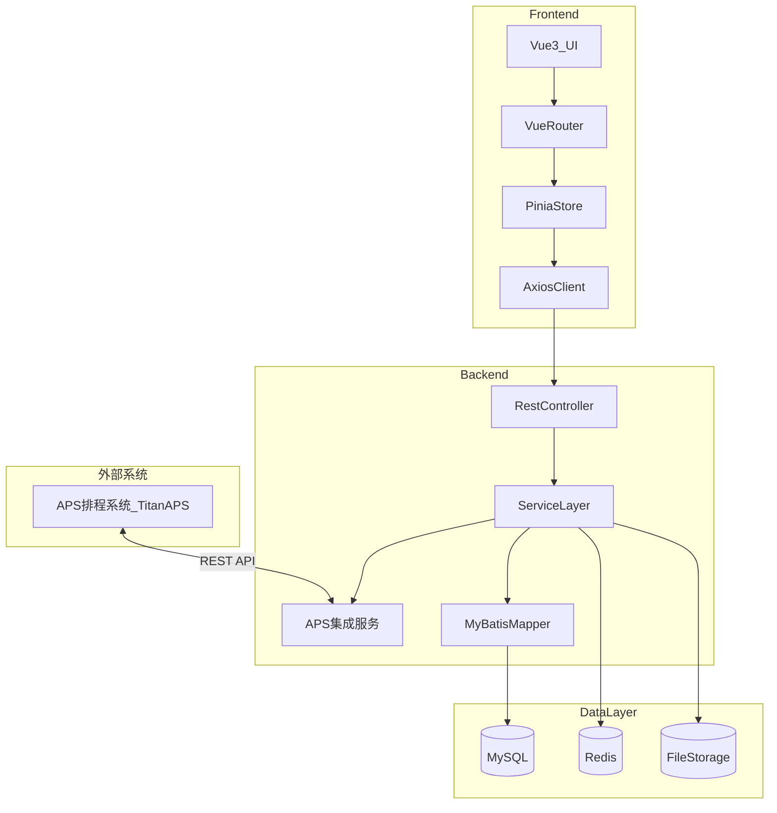
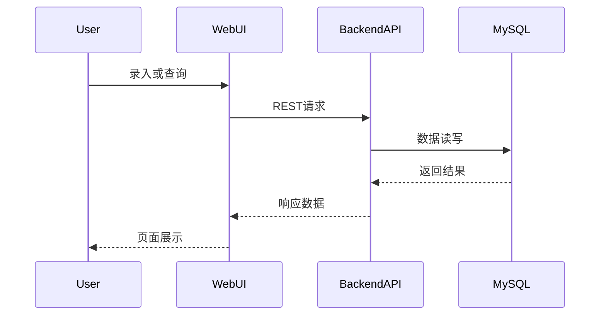
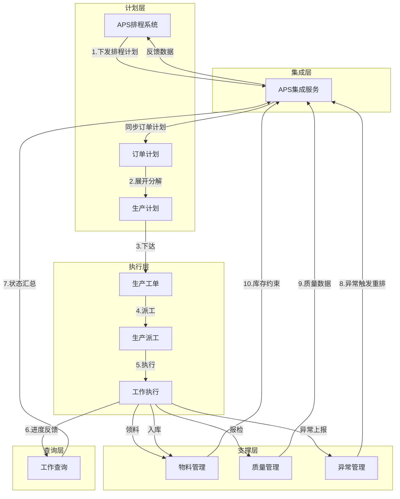
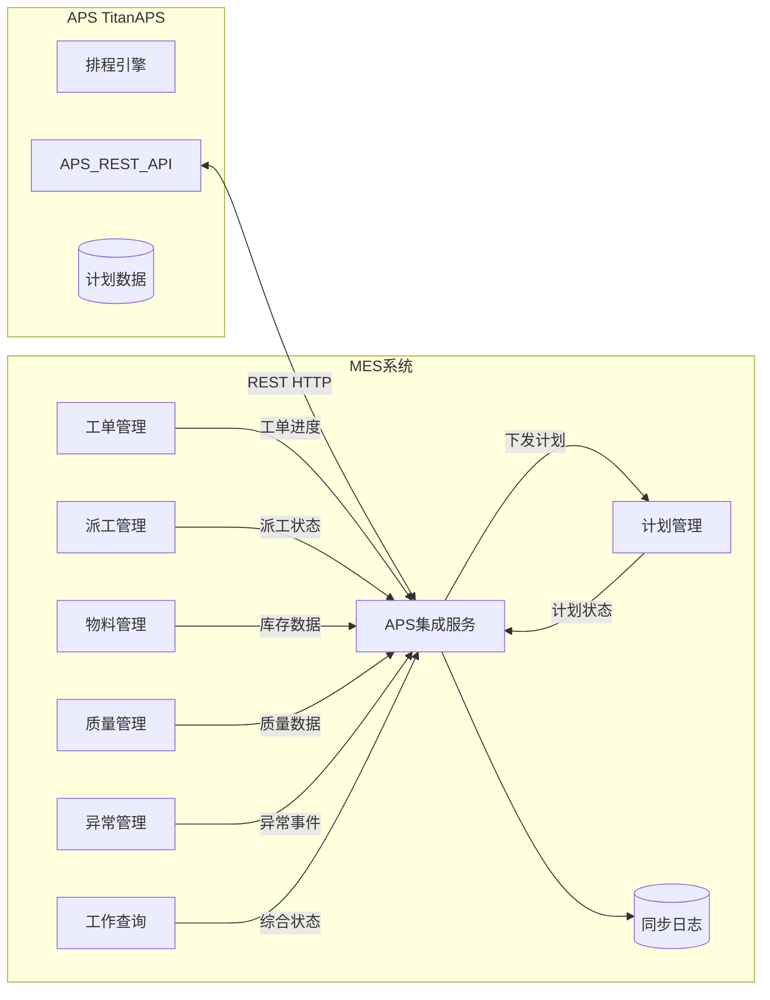
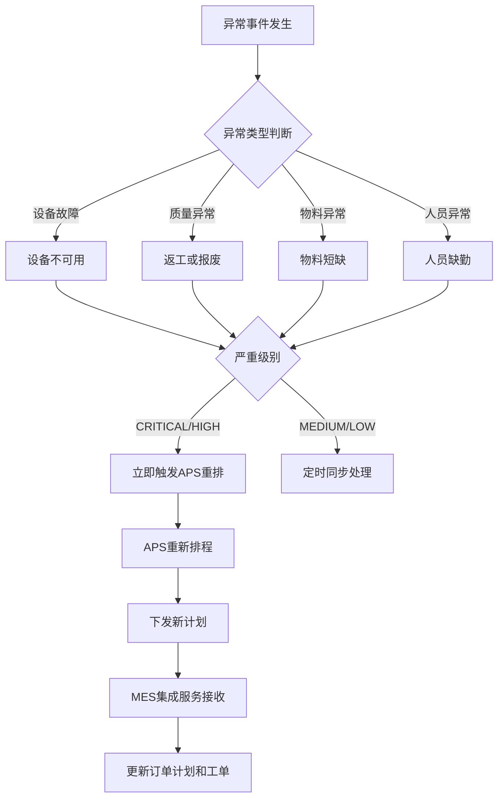

# 系统架构设计

## 1. 架构目标

- 支撑基础数据、班组管理、工艺管理等核心模块的稳定运行  
- 提供清晰的前后端分层与可扩展的模块边界  
- 支持权限控制、审计追踪与数据一致性  
- **与 APS 系统形成双向数据闭环，支持动态排程与执行反馈**  

## 2. 总体架构



## 3. 模块划分

- **基础数据模块**：物料档案、物料价格、工作中心主数据  
- **班组管理模块**：生产班组维护  
- **工艺管理模块**：指示书产品信息、工序模板、指导书、工序信息批量编辑、喷涂条件表、机械加工程序表、制造BOM  
- **生产工单模块**：工单列表、工单详情、工作清单、物料与检验、附件  
- **生产派工模块**：人员分派、设备分派、工作组分派、人员逐级派工  
- **计划管理模块**：订单计划、生产计划（APS 核心衔接层）  
- **异常联络单管理模块**：异常联络单、图片附件、签署管理  
- **成品质量管理模块**：成品复检申请、开工检查实绩、交班记录  
- **工作查询模块**：生产工作/工单开工检查实绩、交班记录、工作六状态查看、派工工作查询  
- **物料管理模块**：存储地点库存、领料/退料/入库管理  
- **APS 集成模块**：APS 数据同步、接口管理、数据映射、同步监控（详见 `13-APS集成模块/需求分析.md`）  

## 4. 关键数据流



## 5. 安全与权限

- 基于角色的访问控制（RBAC），区分查看/编辑/删除/导入/批量编辑权限  
- 关键操作记录审计日志（操作人、时间、字段变化）  
- 接口层统一鉴权与参数校验  
- APS 集成接口使用 API Key 认证，通过请求头 `X-API-Key` 传递  

## 6. 非功能要求

- 查询响应：常规列表分页查询 < 2s  
- 导入能力：支持千级数据导入与错误回滚提示  
- 可扩展性：模块级分包与接口版本化
- APS 同步：定时批量同步延迟 <= 5 分钟，异常重排触发 < 10 秒

---

## 7. 整体业务流程

### 7.1 端到端生产流程总览



### 7.2 业务流程阶段说明

| 阶段 | 流程 | 涉及模块 | 说明 |
|------|------|----------|------|
| **1** | APS 下发排程 | APS集成/计划管理 | APS 排程结果通过集成服务同步至 MES 订单计划 |
| **2** | 订单计划展开 | 计划管理 | 订单计划分解为可执行的生产计划 |
| **3** | 生产计划下达 | 生产工单 | 生产计划下达后生成生产工单及工作清单 |
| **4** | 工单派工 | 生产派工 | 工单任务分配到人员、设备、班组 |
| **5** | 工作执行 | 物料/质量/异常 | 领料 → 生产 → 报检 → 入库 |
| **6** | 进度反馈 | 工作查询 | 实时采集执行状态（开工/完工/暂停） |
| **7** | 状态汇总 | APS集成服务 | 执行数据通过集成服务批量反馈给 APS |
| **8** | 异常触发重排 | APS集成服务 | 关键异常实时触发 APS 重新排程 |
| **9** | 质量数据反馈 | APS集成服务 | 合格率、返工率等定时同步给 APS |
| **10** | 库存约束更新 | APS集成服务 | 库存变动定时同步给 APS |

---

## 8. MES 与 APS 交互详解

### 8.1 交互架构



### 8.2 APS → MES（下行数据）

| 数据类型 | 接收模块 | APS 接口 | 同步方式 | 接口说明 |
|----------|----------|----------|----------|----------|
| **排程计划** | 计划管理-订单计划 | `GET /api/orders?status=SCHEDULED` | 定时拉取（5分钟） | APS 下发订单计划，包含产品、数量、计划时间 |
| **排程任务（含分段）** | 生产工单-工作清单 | `GET /api/tasks?orderId={id}` | 定时拉取 | 工序级排程任务同步到工作清单，含跨班次任务分段 |
| **工单调整** | 生产工单 | `GET /api/orders/{id}` | 定时拉取 | APS 调整工单优先级、计划时间 |
| **外协订单** | 外协管理 | `GET /api/outsource-orders` | 定时拉取 | APS 自动生成的外协订单 |
| **转厂订单** | 转厂管理 | `GET /api/transfer-orders` | 定时拉取 | APS 自动生成的转厂订单 |
| **资源调度/负荷** | 生产派工 | `GET /api/resources`、`GET /api/resources/{id}/load` | 定时拉取 | 资源列表+负荷数据 |
| **资源日历/班次** | 生产派工 | `GET /api/resource-calendars` | 定时拉取（低频） | APS 资源日历和班次定义 |
| **换型时间矩阵** | 生产工单/派工 | `GET /api/setup-matrix` | 定时拉取（低频） | 设备换型准备信息 |
| **甘特图数据** | 计划管理-可视化 | `GET /api/gantt/data` | 按需拉取 | 排程甘特图数据展示 |
| **排程统计/警告** | 计划管理 | `GET /api/schedule/statistics`、`/warnings` | 按需拉取 | 排程健康度和预警信息 |

> 详细接口定义见 `13-APS集成模块/接口契约.md` 第 2 章。

### 8.3 MES → APS（上行数据）

| 数据类型 | 来源模块 | APS 接口 | 触发时机 | 同步方式 | 用途 |
|----------|----------|----------|----------|----------|------|
| **订单锁定** | 生产工单 | `POST /api/orders/{id}/lock` | 工单开工 | 实时 | 锁定订单防止重排调整 |
| **订单解锁** | 生产工单 | `POST /api/orders/{id}/unlock` | 工单完工 | 实时 | 释放资源 |
| **执行状态** | 工单/派工/查询 | `POST /api/mes/status/sync` | 定时（5分钟） | 批量推送 | APS 更新执行进度 |
| **库存变动** | 物料管理 | `POST /api/mes/inventory/sync` | 定时（5分钟） | 批量推送 | APS 更新物料约束 |
| **质量数据** | 成品质量管理 | `POST /api/mes/quality/sync` | 定时（5分钟） | 批量推送 | APS 调整良品率/安排返工 |
| **外协执行状态** | 外协管理 | `POST /api/mes/outsource/status` | 定时（5分钟） | 批量推送 | APS 更新后续工序可开始时间 |
| **转厂物流状态** | 转厂管理 | `POST /api/mes/transfer/status` | 定时（5分钟） | 批量推送 | APS 更新接收方排程 |
| **异常重排** | 异常联络单 | `POST /api/schedule/combined` | 立即触发 | 实时 | **触发 APS 重新排程** |

> 详细接口定义见 `13-APS集成模块/接口契约.md` 第 3 章。

### 8.4 接口错误码

> 完整错误码定义见 `13-APS集成模块/接口契约.md` 第 5 章。

| 错误码 | 说明 | 处理建议 |
|--------|------|----------|
| APS_001 | APS 服务连接失败 | 标记待同步，等待下次重试 |
| APS_002 | APS 服务响应超时 | 增大超时或稍后重试 |
| SYNC_004 | 物料编码映射不存在 | 检查数据映射配置 |
| SYNC_005 | 工作中心映射不存在 | 检查数据映射配置 |
| SYNC_006 | 同步冲突（订单已开工） | MES 实际优先，跳过 |

### 8.5 数据映射与主数据归属

> 完整映射关系见 `13-APS集成模块/数据映射.md`。

**主数据归属原则**：APS 是主数据源（物料/资源/工序/日历），MES 通过映射表引用。MES 是执行数据源（库存/质量/BOM物料组成）。

**核心映射关系**：

| APS 实体 | MES 实体 | 映射键 | 主数据方 |
|----------|----------|--------|---------|
| `ProductionOrder` | `mes_order_plan` | `orderNo` ↔ `order_no` | APS |
| `ScheduleTask` | `mes_work_order_task` | 订单号+工序号 | APS |
| `TaskSegment` | `mes_work_order_task_segment`（新增） | task关联+分段序号 | APS |
| `Item` | `mes_material` | `Item.code` ↔ `material_code` | APS |
| `Resource` | `mes_work_center` | `Resource.code` ↔ `work_center_code` | APS |
| `ProcessDefinition` | `mes_process_template` | 编码映射 | APS |
| `ProductRouting` | `mes_manufacturing_bom` | 产品编码+工序关联 | 双方各维护 |
| `ResourceCalendar` | 资源日历（新增） | 日历ID | APS |
| `OutsourceOrder` | `mes_outsource_order`（新增） | 外协订单号 | 双向 |
| `TransferOrder` | `mes_transfer_order`（新增） | 转厂单号 | 双向 |
| `SetupMatrix` | 换型时间（只读） | 资源+物料 | APS |

### 8.6 重排触发场景



| 触发场景 | 来源模块 | 严重级别 | 触发方式 | APS 响应 |
|----------|----------|----------|----------|----------|
| 设备故障 | 异常联络单 | CRITICAL | 立即触发 | 重新分配设备，调整工单顺序 |
| 质量不合格（批量） | 成品质量管理 | HIGH | 立即触发 | 安排返工或补产 |
| 物料短缺 | 物料管理 | HIGH | 立即触发 | 调整生产顺序，优先安排有料工单 |
| 紧急插单 | 计划管理 | HIGH | 立即触发 | 重新优化整体排程 |
| 客户交期变更 | 计划管理 | HIGH | 立即触发 | 重新调整优先级和排程 |
| 外协延迟 | 外协管理 | HIGH | 立即触发 | 调整后续依赖工序 |
| 工艺路线变更 | 工艺管理 | HIGH | 立即触发 | 工序增减影响排程 |
| 转厂物流延误 | 转厂管理 | MEDIUM | 立即触发 | 调整接收方排程 |
| 工单延期 | 工作查询 | MEDIUM | 定时同步 | 重新排程后续关联工单 |
| 人员缺勤 | 异常联络单 | MEDIUM | 定时同步 | 调整人员分配 |
| 产能变化 | 基础数据 | MEDIUM | 定时同步 | 设备效率变化影响排程 |

---

## 9. 各模块在流程中的作用

### 9.1 计划管理模块

**定位**：MES 与 APS 的核心衔接层

| 功能 | 与 APS 关系 |
|------|-------------|
| 订单计划 | 通过 APS 集成服务接收排程计划 |
| 生产计划 | 将订单分解为可执行计划，下达工单 |
| 进度反馈 | 计划完成状态通过集成服务回传 APS |

### 9.2 生产工单模块

**定位**：生产执行的核心载体

| 功能 | 与 APS 关系 |
|------|-------------|
| 工单创建 | 由生产计划自动生成 |
| 工作清单 | 接收 APS 排程任务，定义具体工序 |
| 状态管理 | 开工时锁定 APS 订单，完工时解锁并反馈 |
| 物料关联 | 输入物料触发领料，输出物料触发入库 |

### 9.3 生产派工模块

**定位**：资源分配与任务落地

| 功能 | 与 APS 关系 |
|------|-------------|
| 人员分派 | 可接收 APS 推荐方案或手动分派 |
| 设备分派 | 设备占用状态反馈 APS |
| 班组分派 | 班组负荷数据供 APS 参考 |
| 逐级派工 | 细化分配，不直接与 APS 交互 |

### 9.4 物料管理模块

**定位**：物料约束与消耗反馈

| 功能 | 与 APS 关系 |
|------|-------------|
| 存储地点库存 | 非限制库存定时同步给 APS 作为排程约束 |
| 生产领料 | 领料消耗通过集成服务反馈 APS |
| 完工入库 | 产出入库通过集成服务反馈 APS |
| 退料管理 | 物料回收更新库存，下次同步时反馈 |

### 9.5 异常联络单管理模块

**定位**：异常触发重排的入口

| 功能 | 与 APS 关系 |
|------|-------------|
| 异常上报 | 记录异常事件 |
| 异常分类 | 设备/质量/物料/人员异常 |
| 影响排程标识 | `affect_schedule=true` 的异常触发重排 |
| 触发重排 | 通过集成服务立即通知 APS 重新排程 |

### 9.6 成品质量管理模块

**定位**：质量数据影响排程

| 功能 | 与 APS 关系 |
|------|-------------|
| 开工检查 | 开工前检查结果影响工单启动 |
| 复检申请 | 质量复检结果反馈 |
| 交班记录 | 质量状况交接 |

### 9.7 工作查询模块

**定位**：执行状态的综合视图

| 功能 | 与 APS 关系 |
|------|-------------|
| 工作六状态查看 | 未开工/已开工/已完工/暂停/终止/待派工 |
| 派工工作查询 | 派工执行状态汇总 |
| 生产工作/检验工作 | 细分查询维度 |

### 9.8 APS 集成模块

**定位**：双向数据同步的统一服务层

| 功能 | 说明 |
|------|------|
| 下行同步 | 定时从 APS 拉取排程计划，同步到 MES 订单计划 |
| 上行同步 | 定时将 MES 执行数据批量推送给 APS |
| 异常重排 | 关键异常实时触发 APS 重新排程 |
| 数据映射 | 管理 APS 与 MES 的编码映射关系 |
| 同步监控 | 记录同步日志，监控同步状态 |

> 详细设计见 `13-APS集成模块/需求分析.md`、`13-APS集成模块/接口契约.md`、`13-APS集成模块/数据映射.md`。

---

## 10. 典型业务场景

### 场景一：正常生产流程

```
APS排程完成 → 集成服务同步订单计划 → 展开生产计划 → 下达工单 → 派工到人员/设备 
→ 领料 → 执行生产 → 报检 → 完工入库 → 集成服务批量反馈APS
```

### 场景二：异常触发重排

```
生产中发现设备故障 → 创建异常联络单（标记影响排程）→ 集成服务立即通知APS 
→ APS重新排程（分配备用设备或调整顺序）→ 集成服务接收新计划 → MES更新工单
```

### 场景三：物料短缺处理

```
领料时发现库存不足 → 物料管理记录库存变动 → 集成服务定时同步库存约束给APS 
→ APS调整工单优先级（优先安排有料工单）→ 集成服务同步调整后计划
```

### 场景四：质量返工

```
成品检验不合格 → 复检申请 → 判定返工 → 质量数据同步给APS（含返工需求）
→ APS自动生成返工任务排入排程 → 集成服务同步新排程 → MES生成返工工单
```

### 场景五：外协工序管理

```
APS排程识别外协工序 → 自动生成外协订单 → 集成服务拉取外协订单 → MES创建外协管理记录
→ 发出外协物料 → 反馈状态(SHIPPED) → 收到外协成品 → 质检 → 反馈状态(QC_PASSED) → APS更新后续工序
```

### 场景六：转厂调度

```
APS排程发现跨工厂工艺路线 → 自动生成转厂订单 → 集成服务拉取转厂订单
→ 一工厂完工发出WIP → 反馈状态(SHIPPED) → 二工厂接收WIP → 反馈状态(RECEIVED)
→ APS更新二工厂排程可开始时间
```
