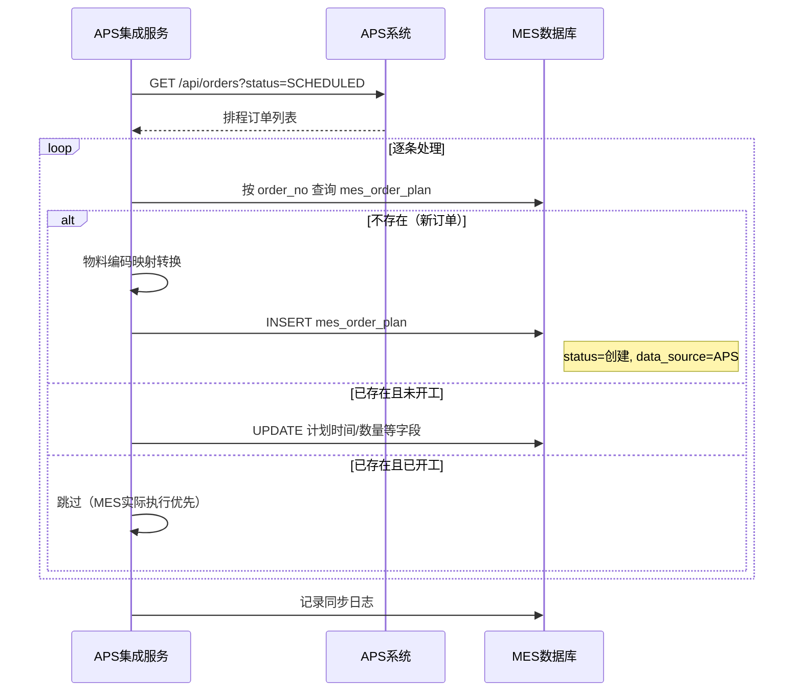

# 计划管理模块需求分析

## 1. 模块概述

计划管理模块是 MES 系统与 APS 系统的核心衔接层，用于接收和管理生产计划，并将计划下达至生产工单。本模块包含两个子功能：

- **订单计划**：承接外部订单或 APS 下发的订单需求，形成生产需求来源
- **生产计划**：将订单计划分解为可执行的生产计划，并下达生成生产工单

## 2. 功能清单

- 订单计划：查询、新增、刷新报表、选择领料申请、展开/收起
- 生产计划：查询、新增、下达、关联订单计划

## 3. 页面需求

### 3.1 订单计划列表

**页面入口**  
计划管理 → 订单计划

**页面操作**  
- 刷新报表  
- 新增  
- 选择领料申请  
- 查询/清空/收藏条件  

**底部功能 Tab**  
- 标准  
- 委外  
- 时间  
- 齐套  
- 缓冲  

**列表字段（示意）**  
- 流程状态（完成/终止/运行中，带颜色标识）  
- 订单号  
- 产品编码  
- 产品名称  
- 项目  
- WBS元素  
- 新制维修类型  
- 类型（维修/检查/主机，带颜色标识）  
- 机型（F3/F4 等）  
- 产品类别（燃烧器/叶片等）  
- 产品类型（T1C/T1S/2C/MN 等）  
- 计划数量  
- 工厂组织  
- 计划组织  
- 主制组织  
- 计划工作中心  
- 状态（创建/已下达/已完成）  
- 展开状态（未展开/全部展开）  
- 计划开始时间  
- 计划结束时间  
- 实际开始时间  
- 实际结束时间  
- 创建时间  
- 修改时间  
- 是否订单  
- PCCL流程  
- 完工状态（审批完成/未开始）  
- **数据来源**（手工录入/APS同步）  
- **APS同步批次号**  

### 3.2 生产计划列表

**页面入口**  
计划管理 → 生产计划

**页面操作**  
- 查询/清空/收藏条件  
- 新增  
- 下达  

**列表字段（示意）**  
- 订单编号  
- 产品  
- 新制维修类型  
- 类型  
- 机型  
- 产品类别  
- 产品类型  
- WBS元素  
- 订单计划（关联订单计划号）  
- 状态（创建/已下达）  
- 计划工单类型（如：标准生产工单）  
- 计划组织  
- 计划数量  
- 数量单位  
- 完工数量  
- 计划开始时间  
- 计划完成时间  
- 实际开始时间  
- 实际完成时间  
- 创建时间  
- 创建人  
- 修改时间  
- 修改人  

## 4. 业务规则

### 4.1 订单计划

- 订单号全局唯一，自动生成或手工录入均需校验。  
- 订单计划状态流转：创建 → 已下达 → 已完成 / 终止。  
- 展开状态：  
  - 未展开：订单计划尚未分解为生产计划。  
  - 全部展开：订单计划已完全分解为生产计划。  
- 完工状态：未开始 → 审批完成。  
- 流程状态通过颜色区分：  
  - 蓝色（完成）  
  - 红色（终止）  
  - 绿色（运行中）  
- 类型字段颜色区分：  
  - 红色（维修）  
  - 黄色（检查）  
  - 蓝色（主机）  

### 4.2 生产计划

- 生产计划必须关联订单计划（订单计划字段）。  
- 生产计划状态流转：创建 → 已下达。  
- 下达后生成对应的生产工单。  
- 计划数量必须大于 0，完工数量不得超过计划数量。  
- 计划工单类型：标准生产工单（可扩展其他类型）。  

### 4.3 与 APS 交互

- 订单计划可由 APS 系统下发，通过 APS 集成服务接收。  
- 生产计划执行进度（完工数量、实际时间）需反馈给 APS。  
- 当生产异常时，APS 可重新排程并下发新的计划版本。  

#### 4.3.1 APS 下行同步（APS → MES 订单计划）

APS 集成服务定时（每 5 分钟）从 APS 拉取已排程的订单数据，同步到 MES 订单计划表 `mes_order_plan`。

**同步流程**：

**字段映射规则**：

| APS 字段 | MES 字段 | 转换规则 |
|----------|----------|----------|
| `orderNo` | `order_no` | 直接映射 |
| `Item.code` | `product_code` | 通过数据映射表转换 |
| `Item.name` | `product_name` | 通过数据映射表转换 |
| `quantity` | `plan_qty` | Integer → Decimal |
| `dueDate` | `plan_end_time` | 交货期映射为计划结束时间 |
| `earliestStartTime` | `plan_start_time` | 最早开始时间映射为计划开始时间 |
| `status`(SCHEDULED) | `status`(创建) | 同步后为"创建"状态，需人工审核下达 |

**冲突处理**：
- 订单计划已存在且状态为"已下达"或"已完成"时，不覆盖 MES 数据
- 订单计划已存在且状态为"创建"时，允许更新计划时间和数量
- APS 重排后的新订单会创建新记录，不影响已有记录

#### 4.3.2 MES 上行反馈（MES 订单计划 → APS）

MES 订单计划状态变更时，通过 APS 集成服务的待同步队列反馈给 APS。

**触发时机**：

| MES 事件 | 反馈内容 | APS 操作 |
|----------|----------|----------|
| 订单计划下达 | 状态变更为"已下达" | 更新订单状态 |
| 生产计划完工 | 完工数量、实际完成时间 | 更新执行进度 |
| 订单计划完成 | 状态变更为"已完成" | 标记订单完成 |
| 订单计划终止 | 状态变更为"终止" | 释放资源 |

**反馈机制**：
1. 状态变更时写入待同步队列 `mes_aps_sync_queue`（`sync_type=ORDER`）
2. APS 集成服务定时（每 5 分钟）批量推送给 APS
3. 推送成功后更新队列状态为 SYNCED

> 详细接口定义见 `13-APS集成模块/接口契约.md`，数据映射见 `13-APS集成模块/数据映射.md`。

## 5. 权限与审计

- 权限粒度：查看、创建、编辑、下达、展开、删除。  
- 订单计划与生产计划的状态变更需记录日志（操作人、操作时间、原状态、新状态）。  
- 关键操作（下达、终止）需记录审计日志。  
- APS 同步操作自动记录到 `mes_aps_sync_log` 表。  

## 6. 与其他模块关系

- **生产工单**：生产计划下达后生成生产工单，工单进度回写计划。  
- **物料管理**：订单计划关联领料申请。  
- **工艺管理**：生产计划关联产品工艺路线。  
- **APS 集成模块**：订单计划的数据来源与执行反馈通道。  

## 7. 数据库设计（表结构）

以下为计划管理模块表结构设计（仅表结构，不生成 SQL 脚本）。

### 7.1 订单计划主表 `mes_order_plan`

| 字段 | 类型 | 说明 |
|---|---|---|
| id | BIGINT | 主键 |
| order_no | VARCHAR(100) | 订单号 |
| product_code | VARCHAR(100) | 产品编码 |
| product_name | VARCHAR(200) | 产品名称 |
| project_name | VARCHAR(200) | 项目 |
| wbs_element | VARCHAR(100) | WBS元素 |
| new_or_repair_type | VARCHAR(50) | 新制维修类型 |
| work_type | VARCHAR(50) | 类型（维修/检查/主机） |
| machine_model | VARCHAR(100) | 机型 |
| product_category | VARCHAR(50) | 产品类别 |
| product_type | VARCHAR(50) | 产品类型 |
| plan_qty | DECIMAL(18,4) | 计划数量 |
| qty_unit | VARCHAR(20) | 数量单位 |
| factory_org | VARCHAR(100) | 工厂组织 |
| plan_org | VARCHAR(100) | 计划组织 |
| main_org | VARCHAR(100) | 主制组织 |
| plan_work_center_id | BIGINT | 计划工作中心 |
| status | VARCHAR(20) | 状态（创建/已下达/已完成/终止） |
| flow_status | VARCHAR(20) | 流程状态（运行中/完成/终止） |
| expand_status | VARCHAR(20) | 展开状态（未展开/全部展开） |
| completion_status | VARCHAR(20) | 完工状态（未开始/审批完成） |
| is_order | TINYINT(1) | 是否订单 |
| pccl_flow | VARCHAR(100) | PCCL流程 |
| plan_start_time | DATETIME | 计划开始时间 |
| plan_end_time | DATETIME | 计划结束时间 |
| actual_start_time | DATETIME | 实际开始时间 |
| actual_end_time | DATETIME | 实际结束时间 |
| data_source | VARCHAR(20) | 数据来源（MANUAL/APS） |
| aps_order_id | BIGINT | APS 订单ID（APS同步时记录） |
| aps_sync_batch_id | VARCHAR(64) | APS 同步批次号 |
| aps_sync_status | VARCHAR(20) | APS 同步状态（SYNCED/PENDING/FAILED） |
| created_by | VARCHAR(50) | 创建人 |
| created_time | DATETIME | 创建时间 |
| updated_by | VARCHAR(50) | 修改人 |
| updated_time | DATETIME | 修改时间 |
| deleted | TINYINT(1) | 逻辑删除 |

### 7.2 生产计划主表 `mes_production_plan`

| 字段 | 类型 | 说明 |
|---|---|---|
| id | BIGINT | 主键 |
| order_plan_id | BIGINT | 订单计划ID |
| order_no | VARCHAR(100) | 订单编号 |
| product_code | VARCHAR(100) | 产品编码 |
| product_name | VARCHAR(200) | 产品名称 |
| new_or_repair_type | VARCHAR(50) | 新制维修类型 |
| work_type | VARCHAR(50) | 类型 |
| machine_model | VARCHAR(100) | 机型 |
| product_category | VARCHAR(50) | 产品类别 |
| product_type | VARCHAR(50) | 产品类型 |
| wbs_element | VARCHAR(100) | WBS元素 |
| work_order_type | VARCHAR(50) | 计划工单类型 |
| plan_org | VARCHAR(100) | 计划组织 |
| plan_qty | DECIMAL(18,4) | 计划数量 |
| qty_unit | VARCHAR(20) | 数量单位 |
| completed_qty | DECIMAL(18,4) | 完工数量 |
| status | VARCHAR(20) | 状态（创建/已下达） |
| plan_start_time | DATETIME | 计划开始时间 |
| plan_end_time | DATETIME | 计划完成时间 |
| actual_start_time | DATETIME | 实际开始时间 |
| actual_end_time | DATETIME | 实际完成时间 |
| created_by | VARCHAR(50) | 创建人 |
| created_time | DATETIME | 创建时间 |
| updated_by | VARCHAR(50) | 修改人 |
| updated_time | DATETIME | 修改时间 |
| deleted | TINYINT(1) | 逻辑删除 |

### 7.3 计划状态日志表 `mes_plan_status_log`

| 字段 | 类型 | 说明 |
|---|---|---|
| id | BIGINT | 主键 |
| plan_type | VARCHAR(20) | 计划类型（ORDER/PRODUCTION） |
| plan_id | BIGINT | 计划ID |
| from_status | VARCHAR(20) | 原状态 |
| to_status | VARCHAR(20) | 新状态 |
| action | VARCHAR(50) | 动作 |
| operator | VARCHAR(50) | 操作人 |
| operated_time | DATETIME | 操作时间 |
| remark | VARCHAR(500) | 说明 |
