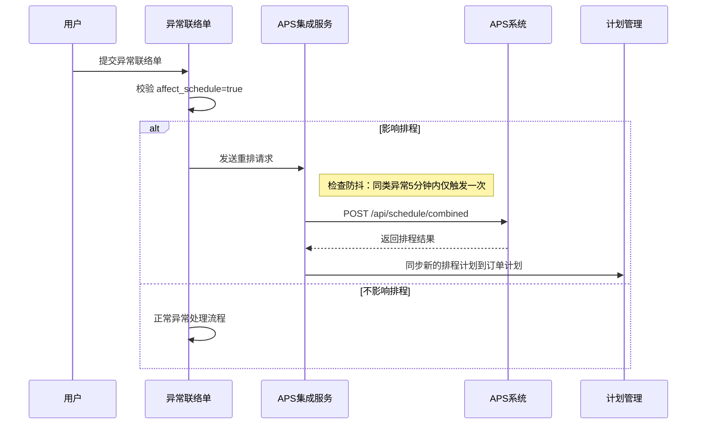

# 异常联络单管理模块需求分析

## 1. 模块概述

异常联络单管理模块用于记录、跟踪和处理生产过程中发现的各类异常问题，包括质量异常、设备异常、物料异常等。异常信息可触发相关流程处理，并为 APS 系统提供重排依据。

## 2. 功能清单

- 异常联络单列表：查询、新增
- 异常联络单详情：查看/编辑基本信息、图片附件、签署状态
- 异常提交与流转

## 3. 页面需求

### 3.1 异常联络单列表

**页面入口**  
异常联络单管理 → 异常联络单

**页面操作**  
- 新增  
- 查询  

**列表字段（示意）**  
- 异常联络单号  
- 主题  
- 发生阶段  
- 事件分类  
- 产品区分  
- 订单号  
- 客户/项目  
- 发布时间  
- 发起部门  
- 产品类型  
- 产品型号  
- 产品名称  
- 发起工序  
- 数量  
- 实物存放点  
- 发现日期  
- 异常描述  

### 3.2 新建异常联络单

**页面操作**  
- 提交  
- 取消  

**基本信息字段（示意）**  
- 异常联络单号（如不填写系统自动生成）  
- 主题  
- 发生阶段（下拉选择）  
- 事件分类（下拉选择）  
- 产品区分（下拉选择）  
- 订单号  
- 客户/项目  
- 发起部门  
- 产品型号（下拉选择）  
- 产品类型（下拉选择）  
- 产品名称（下拉选择）  
- 发起工序  
- 数量（数字输入）  
- 实物存放点  
- 发现日期（日期选择）  

**图片附件列表**  
- 文件编号  
- 负责人  
- 团队  
- 发布时间  
- 提交时间  
- 法大大标识  
- 已签（签署状态）  

**操作**  
- 新增图片  
- 查询  

## 4. 业务规则

### 4.1 单号生成

- 异常联络单号支持手工录入或系统自动生成。  
- 自动生成规则建议：`YC-YYYYMMDD-XXXX`（如 YC-20260203-0001）。  
- 单号全局唯一。  

### 4.2 状态流转

- 异常联络单状态：草稿 → 已提交 → 处理中 → 已关闭。  
- 提交后不可修改基本信息，仅可补充处理记录。  

### 4.3 与 APS 交互

- 异常联络单提交后，可根据事件分类触发 APS 重新排程。  
- 关键异常类型（如设备故障、物料短缺）需标记为"影响排程"，推送给 APS。

#### 4.3.1 重排触发详细逻辑

异常联络单提交时，系统根据 `affect_schedule` 字段和事件分类判断是否触发 APS 重排。

**触发条件**：`affect_schedule = true`（影响排程标识勾选）

**触发流程**：

**异常类型与重排触发对照表**：

| 事件分类 | 严重级别 | 触发方式 | APS 重排策略 | 说明 |
|----------|----------|----------|-------------|------|
| 设备故障 | CRITICAL | 立即触发 | 重新分配设备，调整工单顺序 | 设备不可用影响多个工单 |
| 物料短缺 | HIGH | 立即触发 | 优先安排有料工单 | 影响生产连续性 |
| 质量异常（批量） | HIGH | 立即触发 | 安排返工或补产 | 批量不合格影响产出 |
| 人员缺勤 | MEDIUM | 定时同步 | 调整人员分配 | 可通过内部调配解决 |
| 质量异常（小批量） | LOW | 定时同步 | 辅助排程优化 | 影响范围小 |

**防抖机制**：
- 同一 `event_category`（事件分类）在 5 分钟内仅触发一次重排
- 后续相同类型的异常合并处理，避免重排风暴
- 通过 APS 集成服务内部维护触发时间戳实现

> 详细接口定义见 `13-APS集成模块/接口契约.md` 第 3.3 节。  

### 4.4 签署管理

- 支持电子签署（法大大标识），记录签署人与签署时间。  

## 5. 权限与审计

- 权限粒度：查看、创建、编辑、提交、关闭。  
- 所有操作记录审计日志（操作人、操作时间、变更内容）。  

## 6. 与其他模块关系

- **生产工单**：异常可关联具体工单，影响工单执行。  
- **生产派工**：异常可关联具体派工任务。  
- **计划管理**：关键异常触发计划调整。  
- **APS 集成模块**：`affect_schedule=true` 的异常通过集成服务实时触发 APS 重排，重排结果自动同步回订单计划。  

## 7. 数据库设计（表结构）

以下为异常联络单管理模块表结构设计（仅表结构，不生成 SQL 脚本）。

### 7.1 异常联络单主表 `mes_abnormal_contact`

| 字段 | 类型 | 说明 |
|---|---|---|
| id | BIGINT | 主键 |
| contact_no | VARCHAR(100) | 异常联络单号 |
| subject | VARCHAR(500) | 主题 |
| occur_stage | VARCHAR(50) | 发生阶段 |
| event_category | VARCHAR(50) | 事件分类 |
| product_division | VARCHAR(50) | 产品区分 |
| order_no | VARCHAR(100) | 订单号 |
| customer_project | VARCHAR(200) | 客户/项目 |
| initiate_dept | VARCHAR(100) | 发起部门 |
| product_model | VARCHAR(100) | 产品型号 |
| product_type | VARCHAR(50) | 产品类型 |
| product_name | VARCHAR(200) | 产品名称 |
| initiate_process | VARCHAR(100) | 发起工序 |
| qty | DECIMAL(18,4) | 数量 |
| storage_location | VARCHAR(200) | 实物存放点 |
| discovery_date | DATE | 发现日期 |
| abnormal_desc | TEXT | 异常描述 |
| status | VARCHAR(20) | 状态（草稿/已提交/处理中/已关闭） |
| affect_schedule | TINYINT(1) | 是否影响排程 |
| publish_time | DATETIME | 发布时间 |
| created_by | VARCHAR(50) | 创建人 |
| created_time | DATETIME | 创建时间 |
| updated_by | VARCHAR(50) | 修改人 |
| updated_time | DATETIME | 修改时间 |
| deleted | TINYINT(1) | 逻辑删除 |

### 7.2 异常联络单附件表 `mes_abnormal_contact_attachment`

| 字段 | 类型 | 说明 |
|---|---|---|
| id | BIGINT | 主键 |
| contact_id | BIGINT | 异常联络单ID |
| file_no | VARCHAR(100) | 文件编号 |
| file_name | VARCHAR(200) | 文件名 |
| file_url | VARCHAR(500) | 文件路径 |
| file_type | VARCHAR(50) | 文件类型 |
| responsible_person | VARCHAR(50) | 负责人 |
| team | VARCHAR(100) | 团队 |
| publish_time | DATETIME | 发布时间 |
| submit_time | DATETIME | 提交时间 |
| fadada_flag | VARCHAR(50) | 法大大标识 |
| signed | TINYINT(1) | 已签 |
| created_time | DATETIME | 创建时间 |
| updated_time | DATETIME | 修改时间 |

### 7.3 异常联络单状态日志表 `mes_abnormal_contact_log`

| 字段 | 类型 | 说明 |
|---|---|---|
| id | BIGINT | 主键 |
| contact_id | BIGINT | 异常联络单ID |
| from_status | VARCHAR(20) | 原状态 |
| to_status | VARCHAR(20) | 新状态 |
| action | VARCHAR(50) | 动作 |
| operator | VARCHAR(50) | 操作人 |
| operated_time | DATETIME | 操作时间 |
| remark | VARCHAR(500) | 说明 |
