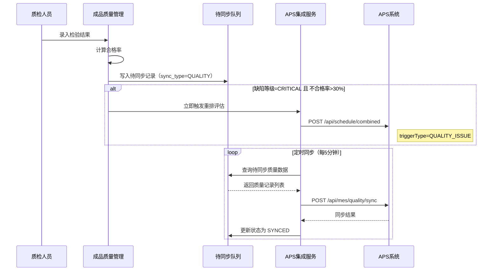

# 成品质量管理模块需求分析

## 1. 模块概述

成品质量管理模块用于管理生产过程中的质量检查与成品复检申请，确保产品质量符合标准。本模块包含多个子功能，支持生产工作开工检查、生产工单开工检查、交班记录及成品复检申请。

## 2. 功能清单

- 异常联络单（跳转至异常联络单模块）
- 生产工作开工检查实绩
- 生产工单开工检查实绩
- 交班记录
- 成品复检申请

## 3. 页面需求

### 3.1 成品复检申请列表

**页面入口**  
成品质量管理 → 成品复检申请

**页面操作**  
- 新增  
- 查询  

**列表字段（示意）**  
- 项目编号  
- 生产订单  
- 复检需求  
- 复检提出时间  
- 复检原因  
- 复检提出人  
- 需求交货时间  
- 是否合理（复选框）  
- 审核人员  
- 审核日期  

### 3.2 创建复检申请

**页面操作**  
- 保存  
- 返回  

**基本信息字段（示意）**  
- 项目编码（如不填写系统自动生成）  
- 项目名称  
- 物料编码  
- 物料名称  

**订单计划关联列表**  
- 创建时间  
- 创建人  
- 修改时间  
- 修改人  
- 被关联对象  

**操作**  
- 新增关联  
- 查询  

**产品序列号列表**  
- 序列号  
- 生产厂商  
- 名称  
- 状态分类  
- 数量  
- 冻结  
- 拆分完成  
- 计量单位  
- 条码号  

**操作**  
- 新增  
- 查询  

**复检信息**  
- 复检提出人  
- 复检提出时间（日期选择）  
- 需求交货时间（日期选择）  

### 3.3 生产工作开工检查实绩

**页面目标**  
记录生产工作开工前的检查结果。

**列表字段（示意）**  
- 工作编号  
- 工单号  
- 检查项目  
- 检查结果  
- 检查人  
- 检查时间  
- 备注  

### 3.4 生产工单开工检查实绩

**页面目标**  
记录生产工单开工前的检查结果。

**列表字段（示意）**  
- 工单号  
- 检查项目  
- 检查结果  
- 检查人  
- 检查时间  
- 备注  

### 3.5 交班记录

**页面目标**  
记录班次交接信息，确保生产连续性。

**列表字段（示意）**  
- 交班日期  
- 交班班组  
- 接班班组  
- 交班人  
- 接班人  
- 交班内容  
- 备注  

## 4. 业务规则

### 4.1 复检申请

- 项目编码支持手工录入或系统自动生成。  
- 复检申请必须关联订单计划或产品序列号。  
- 复检提出时间默认为当前日期。  
- 审核流程：提交 → 审核（是否合理） → 审核完成。  

### 4.2 开工检查

- 开工检查需在工单/工作开工前完成。  
- 检查结果影响工单/工作能否正常开工。  
- 检查不通过需关联异常联络单。  

### 4.3 交班记录

- 交班记录按班次日期管理。  
- 交班内容需包含未完成事项、异常情况等关键信息。  

### 4.4 与 APS 交互

#### 4.4.1 质量数据同步给 APS

APS 集成服务定时（每 5 分钟）将 MES 质量检验数据同步给 APS，用于排程参数动态调整。

**同步数据字段**：

| 数据项 | 来源 | APS 用途 | 说明 |
|--------|------|---------|------|
| 合格率（qualifyRate） | 检验结果 | 动态修正工序良品率 | 影响净需求量计算 |
| 不合格数量（unqualifiedQty） | 检验结果 | 计算补产需求 | APS 自动评估是否需要补产 |
| 返工需求（needRework + reworkQty） | 检验判定 | 生成返工排程任务 | APS 将返工工序排入排程 |
| 缺陷等级（defectLevel） | 检验判定 | 评估是否触发重排 | CRITICAL 级可触发立即重排 |
| 缺陷类型（defectType） | 检验判定 | 辅助排程优化 | APS 统计分析用 |

**触发时机**：
- 检验工作完成并录入结果后，向 `mes_aps_sync_queue` 写入一条记录（`sync_type=QUALITY`）
- APS 集成服务定时批量查询待同步的质量数据
- 通过 `POST /api/mes/quality/sync` 推送给 APS
- 推送成功后标记队列状态为 SYNCED

**同步机制**：

**数据映射**：
- MES `work_order_no` + `process_sequence` → APS `ScheduleTask`（通过订单号+工序号关联）
- MES `material_code` → APS `Item.code`（通过数据映射表转换）

#### 4.4.2 质量异常触发重排条件

| 场景 | 判定条件 | 触发方式 | APS 操作 |
|------|---------|---------|---------|
| 批量严重缺陷 | defectLevel=CRITICAL 且 不合格率>30% | 立即触发 | 安排返工+评估交期影响 |
| 需要返工 | needRework=true | 定时同步 | APS 生成返工任务排入排程 |
| 检查不通过拒绝开工 | 开工检查结果=不通过 | 联动异常联络单 | 通过异常联络单触发重排 |
| 复检申请影响交期 | 复检导致工序延期 | 定时同步 | APS 更新工序预计完成时间 |

> 详细接口定义见 `13-APS集成模块/接口契约.md` 第 3.6 节，数据映射见 `13-APS集成模块/数据映射.md`。  

## 5. 权限与审计

- 权限粒度：查看、创建、编辑、审核、删除。  
- 复检审核需特定权限。  
- 所有操作记录审计日志。  

## 6. 与其他模块关系

- **生产工单**：开工检查关联工单，复检关联生产订单。  
- **计划管理**：复检申请关联订单计划。  
- **异常联络单管理**：检查不通过可触发异常联络单。  
- **班组管理**：交班记录关联班组信息。  
- **APS 集成模块**：质量数据（合格率/返工需求/缺陷等级）定时同步给 APS 调整排程参数；批量严重缺陷通过异常联络单实时触发 APS 重排。  

## 7. 数据库设计（表结构）

以下为成品质量管理模块表结构设计（仅表结构，不生成 SQL 脚本）。

### 7.1 复检申请主表 `mes_recheck_request`

| 字段 | 类型 | 说明 |
|---|---|---|
| id | BIGINT | 主键 |
| project_code | VARCHAR(100) | 项目编码 |
| project_name | VARCHAR(200) | 项目名称 |
| material_code | VARCHAR(100) | 物料编码 |
| material_name | VARCHAR(200) | 物料名称 |
| production_order_no | VARCHAR(100) | 生产订单 |
| recheck_requirement | VARCHAR(500) | 复检需求 |
| recheck_reason | VARCHAR(500) | 复检原因 |
| recheck_proposer | VARCHAR(50) | 复检提出人 |
| recheck_propose_time | DATETIME | 复检提出时间 |
| required_delivery_time | DATETIME | 需求交货时间 |
| is_reasonable | TINYINT(1) | 是否合理 |
| reviewer | VARCHAR(50) | 审核人员 |
| review_date | DATE | 审核日期 |
| status | VARCHAR(20) | 状态 |
| created_by | VARCHAR(50) | 创建人 |
| created_time | DATETIME | 创建时间 |
| updated_by | VARCHAR(50) | 修改人 |
| updated_time | DATETIME | 修改时间 |
| deleted | TINYINT(1) | 逻辑删除 |

### 7.2 复检申请订单计划关联表 `mes_recheck_order_plan`

| 字段 | 类型 | 说明 |
|---|---|---|
| id | BIGINT | 主键 |
| recheck_id | BIGINT | 复检申请ID |
| order_plan_id | BIGINT | 订单计划ID |
| related_object | VARCHAR(200) | 被关联对象 |
| created_by | VARCHAR(50) | 创建人 |
| created_time | DATETIME | 创建时间 |
| updated_by | VARCHAR(50) | 修改人 |
| updated_time | DATETIME | 修改时间 |

### 7.3 复检申请产品序列号表 `mes_recheck_serial`

| 字段 | 类型 | 说明 |
|---|---|---|
| id | BIGINT | 主键 |
| recheck_id | BIGINT | 复检申请ID |
| serial_no | VARCHAR(100) | 序列号 |
| manufacturer | VARCHAR(200) | 生产厂商 |
| name | VARCHAR(200) | 名称 |
| status_category | VARCHAR(50) | 状态分类 |
| qty | DECIMAL(18,4) | 数量 |
| frozen | TINYINT(1) | 冻结 |
| split_completed | TINYINT(1) | 拆分完成 |
| unit | VARCHAR(20) | 计量单位 |
| barcode | VARCHAR(100) | 条码号 |

### 7.4 生产工作开工检查表 `mes_work_start_check`

| 字段 | 类型 | 说明 |
|---|---|---|
| id | BIGINT | 主键 |
| work_order_task_id | BIGINT | 工作清单ID |
| work_order_id | BIGINT | 工单ID |
| work_no | VARCHAR(100) | 工作编号 |
| work_order_no | VARCHAR(100) | 工单号 |
| check_item | VARCHAR(200) | 检查项目 |
| check_result | VARCHAR(50) | 检查结果 |
| checker | VARCHAR(50) | 检查人 |
| check_time | DATETIME | 检查时间 |
| remark | VARCHAR(500) | 备注 |
| created_time | DATETIME | 创建时间 |
| updated_time | DATETIME | 修改时间 |

### 7.5 生产工单开工检查表 `mes_order_start_check`

| 字段 | 类型 | 说明 |
|---|---|---|
| id | BIGINT | 主键 |
| work_order_id | BIGINT | 工单ID |
| work_order_no | VARCHAR(100) | 工单号 |
| check_item | VARCHAR(200) | 检查项目 |
| check_result | VARCHAR(50) | 检查结果 |
| checker | VARCHAR(50) | 检查人 |
| check_time | DATETIME | 检查时间 |
| remark | VARCHAR(500) | 备注 |
| created_time | DATETIME | 创建时间 |
| updated_time | DATETIME | 修改时间 |

### 7.6 交班记录表 `mes_shift_handover`

| 字段 | 类型 | 说明 |
|---|---|---|
| id | BIGINT | 主键 |
| handover_date | DATE | 交班日期 |
| handover_team_id | BIGINT | 交班班组ID |
| handover_team_name | VARCHAR(200) | 交班班组 |
| takeover_team_id | BIGINT | 接班班组ID |
| takeover_team_name | VARCHAR(200) | 接班班组 |
| handover_person | VARCHAR(50) | 交班人 |
| takeover_person | VARCHAR(50) | 接班人 |
| handover_content | TEXT | 交班内容 |
| remark | VARCHAR(500) | 备注 |
| created_by | VARCHAR(50) | 创建人 |
| created_time | DATETIME | 创建时间 |
| updated_by | VARCHAR(50) | 修改人 |
| updated_time | DATETIME | 修改时间 |
