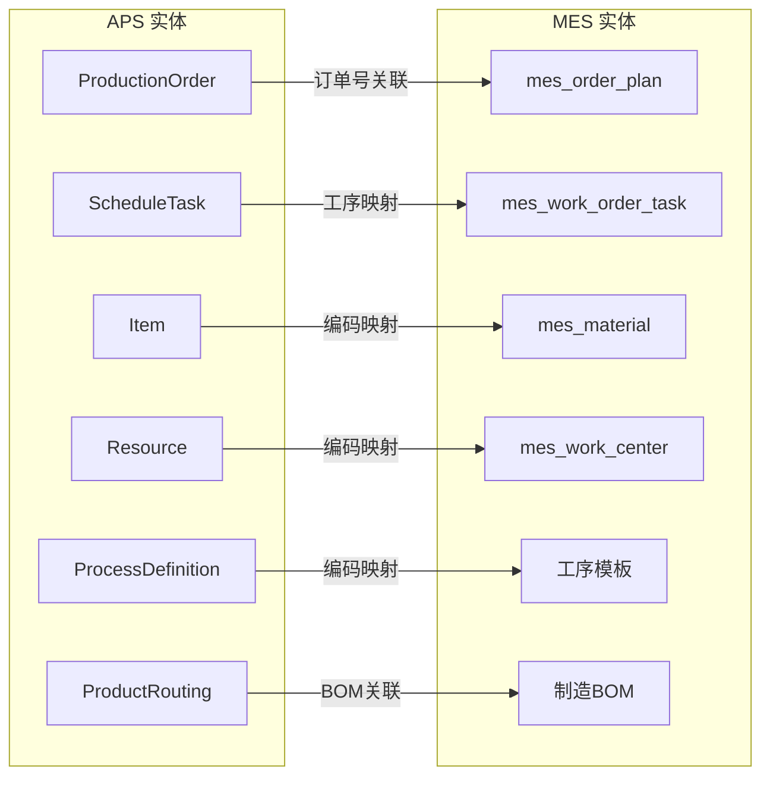

# APS 与 MES 数据映射关系

## 1. 概述

本文档定义 APS（Titan APS）系统与 MES 系统之间的实体映射、字段映射和状态映射关系。数据映射是 APS 集成的基础，确保两个系统之间的数据能够正确转换和同步。

## 2. 实体映射总览

## 3. 订单映射

### 3.1 APS ProductionOrder → MES mes_order_plan

| APS 字段 | APS 类型 | MES 字段 | MES 类型 | 映射说明 |
|----------|----------|----------|----------|----------|
| `orderNo` | String | `order_no` | VARCHAR(100) | **主键关联**，订单编号全局唯一 |
| `itemId` → `Item.code` | Long → String | `product_code` | VARCHAR(100) | 通过物料映射表转换 |
| `itemId` → `Item.name` | Long → String | `product_name` | VARCHAR(200) | 通过物料映射表转换 |
| `quantity` | Integer | `plan_qty` | DECIMAL(18,4) | 类型转换：Integer → Decimal |
| `dueDate` | LocalDateTime | `plan_end_time` | DATETIME | 交货期映射为计划结束时间 |
| `earliestStartTime` | LocalDateTime | `plan_start_time` | DATETIME | 最早开始时间映射为计划开始时间 |
| `priority` | Integer | - | - | MES 订单计划暂无优先级字段，建议扩展 |
| `status` | String | `status` | VARCHAR(20) | 状态映射（见 3.2） |
| `orderType` | String | `work_type` | VARCHAR(50) | 需转换：FORMAL→主机, FORECAST→检查 |
| - | - | `flow_status` | VARCHAR(20) | MES 独有：运行中/完成/终止 |
| - | - | `expand_status` | VARCHAR(20) | MES 独有：未展开/全部展开 |
| - | - | `factory_org` | VARCHAR(100) | MES 独有：工厂组织 |
| - | - | `plan_org` | VARCHAR(100) | MES 独有：计划组织 |

### 3.2 订单状态映射

| APS 状态 | APS 含义 | MES 状态 | MES 含义 | 同步方向 | 说明 |
|----------|----------|----------|----------|----------|------|
| PENDING | 待排程 | 创建 | 新建未下达 | APS → MES | 新订单初始状态 |
| SCHEDULED | 已排程 | 已下达 | 计划已下达 | APS → MES | 排程完成自动下达 |
| LOCKED | 已锁定 | 已下达（锁定） | 锁定不可调整 | 双向 | MES 开工时锁定 APS |
| - | - | 已完成 | 计划完成 | MES → APS | MES 独有终态 |
| - | - | 终止 | 计划终止 | MES → APS | MES 独有终态 |

### 3.3 MES 工单状态 → APS 操作映射

| MES 工单事件 | MES 状态变化 | APS 操作 | APS 接口 | 说明 |
|-------------|-------------|----------|----------|------|
| 工单下发 | 创建 → 下发 | 无操作 | - | MES 内部流转 |
| 工单开工 | 下发 → 执行中 | 锁定订单 | `POST /api/orders/{id}/lock` | 防止 APS 重排调整 |
| 工单完工 | 执行中 → 完工 | 解锁+标记完成 | `POST /api/orders/{id}/unlock` | 释放资源 |
| 工单强制完工 | 执行中 → 完工 | 解锁+标记完成 | `POST /api/orders/{id}/unlock` | 特殊完工 |

## 4. 任务/工序映射

### 4.1 APS ScheduleTask → MES mes_work_order_task

| APS 字段 | APS 类型 | MES 字段 | MES 类型 | 映射说明 |
|----------|----------|----------|----------|----------|
| `id` | Long | - | - | APS 内部 ID，不映射 |
| `orderId` → `orderNo` | Long → String | `work_order_id` | BIGINT | 通过订单号关联工单 |
| `processSequence` | Integer | `sequence_no` | INT | 工序顺序号 |
| `processName` | String | `task_name` | VARCHAR(200) | 工序名称 → 工作名称 |
| `resourceId` → `Resource.code` | Long → String | `plan_work_center_id` | BIGINT | 通过工作中心映射表转换 |
| `quantity` | Integer | `plan_qty` | DECIMAL(18,4) | 计划数量 |
| `startTime` | LocalDateTime | - | - | MES 工作清单暂无独立时间字段 |
| `endTime` | LocalDateTime | - | - | 同上 |
| `taskType` | String(WORK/SETUP) | - | - | MES 暂无任务类型区分 |

### 4.2 任务类型映射

| APS taskType | 说明 | MES 对应 |
|-------------|------|----------|
| WORK | 加工任务 | 标准工作清单项 |
| SETUP | 换型任务 | 建议在 MES 工作清单中扩展换型标识字段 |

## 5. 物料映射

### 5.1 APS Item → MES mes_material

| APS 字段 | APS 类型 | MES 字段 | MES 类型 | 映射说明 |
|----------|----------|----------|----------|----------|
| `code` | String | `material_code` | VARCHAR(50) | **编码映射键** |
| `name` | String | `material_name` | VARCHAR(200) | 物料名称 |
| `itemType` | String | `material_type` | VARCHAR(50) | 类型映射（见 5.2） |
| `inventory` | Integer | `unrestricted_stock` | DECIMAL(18,4) | APS 库存 → MES 非限制库存 |

### 5.2 物料类型映射

| APS itemType | APS 含义 | MES material_type | MES 含义 |
|-------------|----------|-------------------|----------|
| RAW_MATERIAL | 原材料 | 原材料 | 原材料 |
| SEMI_FINISHED | 半成品 | 半成品 | 半成品 |
| FINISHED_PRODUCT | 成品 | 成品 | 成品 |

### 5.3 库存数据映射

| MES 库存字段 | MES 含义 | APS 映射 | 说明 |
|-------------|----------|----------|------|
| `unrestricted_stock` | 非限制库存 | `Item.inventory` | APS 可用库存 = MES 非限制库存 |
| `quality_stock` | 质检库存 | - | APS 不感知质检库存 |
| `frozen_stock` | 冻结库存 | - | APS 不感知冻结库存 |

> **注意**：APS 排程时使用的库存约束仅基于 MES 的非限制库存（可用库存），质检和冻结库存不纳入排程约束。

## 6. 资源/工作中心映射

### 6.1 APS Resource → MES mes_work_center

| APS 字段 | APS 类型 | MES 字段 | MES 类型 | 映射说明 |
|----------|----------|----------|----------|----------|
| `code` | String | `work_center_code` | VARCHAR(50) | **编码映射键** |
| `name` | String | `work_center_name` | VARCHAR(200) | 资源/工作中心名称 |
| `resourceType` | String | `resource_type` | VARCHAR(50) | 资源类型 |
| `efficiency` | Double | `efficiency` | DECIMAL(5,2) | 效率 |
| `enabled` | Boolean | - | - | MES 暂无启用标识（建议扩展） |

### 6.2 资源类型映射

| APS resourceType | 说明 | MES 对应 |
|-----------------|------|----------|
| MACHINE | 机器设备 | resource_type = '设备' |
| FURNACE | 炉子设备 | furnace_resource_type 字段 |
| MANUAL | 人工工位 | resource_type = '人工' |

## 7. 工序映射

### 7.1 APS ProcessDefinition → MES 工序模板

| APS 字段 | MES 对应 | 说明 |
|----------|----------|------|
| `code` | 工序模板编码 | 编码映射键 |
| `name` | 工序模板名称 | 工序名称 |
| `isBottleneck` | - | MES 暂无瓶颈标识 |

## 8. 工艺路线映射

### 8.1 APS ProductRouting → MES 制造BOM

> **说明**：APS 和 MES 各自维护工艺路线/BOM数据，通过映射表关联而非直接同步。APS 的 `ProductRouting` 侧重排程参数（工时、换型、资源约束），MES 的制造BOM 侧重物料组成和投入产出。

| APS 字段 | APS 类型 | MES 对应 | MES 类型 | 映射说明 |
|----------|----------|----------|----------|----------|
| `item` → `Item.code` | String | `mes_manufacturing_bom.product_code` | VARCHAR(100) | 产品关联（通过物料映射表） |
| `process` → `ProcessDefinition.code` | String | `mes_manufacturing_bom_item.process_no` | VARCHAR(50) | 物料投入工序关联 |
| `defaultResource` → `Resource.code` | String | `mes_process_template.work_center_id` | BIGINT | 默认资源（通过工作中心映射表） |
| `processSequence` | Integer | `mes_manufacturing_bom_item.sequence_no` | INT | 工序顺序号 |
| `standardTime` | Integer | `mes_process_template.handle_time` | DECIMAL(10,2) | 标准加工时间（分钟） |
| `setupTime` | Integer | - | - | MES 暂无独立换型时间字段，由 APS 管理 |
| `preSetupTime` | Integer | - | - | 预换型时间，APS 独有 |
| `connectionType` | String | - | - | 工序连接类型（SS/FS），APS 排程参数 |
| `lagTime` | Integer | - | - | 工序间隔时间，APS 排程参数 |
| `transferBatch` | Integer | - | - | 转移批量，APS 排程参数 |
| `isOutsource` | Boolean | `mes_manufacturing_bom_item.supply_type` | VARCHAR(20) | `true` → 供应类型='委外' |
| `supplier` → `Supplier.name` | String | - | - | 外协供应商，通过供应商映射表 |
| `inputs` (RoutingInput) | List | `mes_manufacturing_bom_item`（投入物料） | - | 工序投入物料 |
| `outputs` (RoutingOutput) | List | `mes_manufacturing_bom_item`（产出物料） | - | 工序产出物料 |

### 8.2 APS-MES 双方数据职责

| 数据项 | APS 职责 | MES 职责 |
|--------|---------|---------|
| 工艺路线结构 | 维护排程用工艺路线（含排程参数） | 维护制造BOM（含物料投入产出） |
| 标准工时 | 排程参数，驱动排程计算 | 参考值，展示给操作员 |
| 换型时间 | 排程参数，优化排程顺序 | 参考值，派工参考 |
| 物料用量 | 通过 RoutingInput 计算物料需求 | BOM 管理实际物料清单 |
| 外协标识 | 控制外协工序排程 | 追踪外协执行进度 |

## 9. 任务分段映射

### 9.1 APS TaskSegment → MES 工作清单任务分段

> **说明**：当排程任务跨越非工作时间（休息、下班、周末、节假日）时，APS 会将任务拆分为多个时间段（TaskSegment）。MES 需记录这些分段以便车间按班次执行。

| APS 字段 | APS 类型 | MES 字段 | MES 类型 | 映射说明 |
|----------|----------|----------|----------|----------|
| `task.id` | Long | `work_order_task_id` | BIGINT | 所属工作清单项 |
| `segmentIndex` | Integer | `segment_index` | INT | 分段序号（从1开始） |
| `startTime` | LocalDateTime | `segment_start_time` | DATETIME | 分段开始时间 |
| `endTime` | LocalDateTime | `segment_end_time` | DATETIME | 分段结束时间 |
| `durationMinutes` | Integer | `segment_duration` | INT | 分段时长（分钟） |

**MES 扩展建议**：在 `mes_work_order_task` 表中新增子表 `mes_work_order_task_segment` 存储任务分段信息：

| 字段 | 类型 | 说明 |
|------|------|------|
| id | BIGINT | 主键 |
| work_order_task_id | BIGINT | 工作清单项 ID |
| segment_index | INT | 分段序号 |
| segment_start_time | DATETIME | 分段开始时间 |
| segment_end_time | DATETIME | 分段结束时间 |
| segment_duration | INT | 分段时长（分钟） |
| shift_name | VARCHAR(50) | 所属班次名称（MES 填充） |
| assigned_team_id | BIGINT | 负责班组ID（MES 填充，可选） |
| actual_start_time | DATETIME | 实际开始时间（MES 回填） |
| actual_end_time | DATETIME | 实际结束时间（MES 回填） |
| status | VARCHAR(20) | 分段状态：PENDING/IN_PROGRESS/COMPLETED |
| created_time | DATETIME | 创建时间 |
| updated_time | DATETIME | 修改时间 |

## 10. 外协订单映射

### 10.1 APS OutsourceOrder → MES 外协订单

> **说明**：APS 排程时自动为外协工序生成外协订单，MES 接收后追踪外协执行（发出、收货、质检）。MES 需新增外协订单管理表。

| APS 字段 | MES 字段 | 映射说明 |
|----------|----------|----------|
| `orderNo` | `outsource_order_no` | 外协订单号（关联键） |
| `parentOrderId` → `parentOrderNo` | `parent_order_no` | 主生产订单号 |
| `itemCode` | `material_code` | 物料编码（通过映射表） |
| `quantity` | `plan_qty` | 计划数量 |
| `supplierName` | `supplier_name` | 供应商名称 |
| `processSequence` | `process_sequence` | 工序顺序号 |
| `processName` | `process_name` | 工序名称 |
| `expectedStartTime` | `plan_start_time` | 计划开始时间 |
| `expectedEndTime` | `plan_end_time` | 计划结束时间 |
| `status` | `aps_status` | APS 状态 |
| - | `mes_status` | MES 执行状态（PENDING/SHIPPED/RECEIVED/QC_PASSED/COMPLETED） |
| - | `actual_ship_time` | 实际发出时间（MES 回填） |
| - | `actual_receive_time` | 实际收货时间（MES 回填） |
| - | `received_qty` | 实际收货数量（MES 回填） |
| - | `qualified_qty` | 合格数量（MES 回填） |

**MES 扩展建议**：新增 `mes_outsource_order` 表管理外协订单执行。

## 11. 转厂订单映射

### 11.1 APS TransferOrder → MES 转厂订单

> **说明**：多工厂场景下，APS 自动生成转厂订单用于工厂间 WIP 流转。MES 接收后追踪物流进度。

| APS 字段 | MES 字段 | 映射说明 |
|----------|----------|----------|
| `transferNo` | `transfer_no` | 转厂单号（关联键） |
| `parentOrderNo` | `parent_order_no` | 主生产订单号 |
| `itemCode` | `material_code` | 物料编码（通过映射表） |
| `quantity` | `plan_qty` | 计划数量 |
| `fromFactoryName` | `from_factory` | 发出工厂 |
| `toFactoryName` | `to_factory` | 接收工厂 |
| `expectedShipDate` | `plan_ship_time` | 计划发出时间 |
| `expectedArriveDate` | `plan_arrive_time` | 计划到达时间 |
| `status` | `aps_status` | APS 状态 |
| - | `mes_status` | MES 执行状态（PENDING/SHIPPED/IN_TRANSIT/ARRIVED/RECEIVED） |
| - | `actual_ship_time` | 实际发出时间（MES 回填） |
| - | `actual_arrive_time` | 实际到达时间（MES 回填） |
| - | `received_qty` | 实际接收数量（MES 回填） |

**MES 扩展建议**：新增 `mes_transfer_order` 表管理转厂订单执行。

## 12. 资源日历与班次映射

### 12.1 APS ResourceCalendar → MES 资源日历

> **说明**：APS 是资源日历的主数据源。MES 拉取日历数据用于派工参考和任务分段解读。

| APS 字段 | MES 字段 | 映射说明 |
|----------|----------|----------|
| `ResourceCalendar.id` | `aps_calendar_id` | APS 日历 ID |
| `ResourceCalendar.name` | `calendar_name` | 日历名称 |
| `CalendarShift.dayOfWeek` | `day_of_week` | 星期几 |
| `CalendarShift.startTime` | `shift_start_time` | 班次开始时间 |
| `CalendarShift.endTime` | `shift_end_time` | 班次结束时间 |
| `CalendarShift.shiftName` | `shift_name` | 班次名称 |

### 12.2 APS FactoryCalendar → MES 工厂日历

| APS 字段 | MES 字段 | 映射说明 |
|----------|----------|----------|
| `date` | `calendar_date` | 日期 |
| `isHoliday` | `is_holiday` | 是否节假日 |
| `description` | `description` | 说明 |

## 13. 换型时间矩阵映射

### 13.1 APS SetupMatrix → MES 换型时间参考

> **说明**：换型时间矩阵由 APS 维护，MES 只读取展示。用于车间操作人员了解设备换型准备时间。

| APS 字段 | MES 用途 | 映射说明 |
|----------|---------|----------|
| `resourceId` → `Resource.code` | 关联工作中心 | 通过工作中心映射表 |
| `fromItemCode` | 当前生产物料 | 通过物料映射表 |
| `toItemCode` | 下一生产物料 | 通过物料映射表 |
| `setupTimeMinutes` | 换型时间（分钟） | 直接使用 |

## 14. 工厂映射

### 14.1 APS Factory → MES 工厂组织

> **说明**：APS 支持多工厂排程，`ProductionOrder` 和 `Resource` 均有 factory 关联。MES 需维护工厂映射以支持多工厂场景。

| APS 字段 | MES 字段 | 映射说明 |
|----------|----------|----------|
| `Factory.id` | - | APS 内部 ID |
| `Factory.code`（推断） | `factory_org` | 工厂编码映射键 |
| `Factory.name`（推断） | 工厂名称 | 工厂名称 |

**映射配置**：在 `mes_aps_data_mapping` 表中增加 `mapping_type='FACTORY'` 的映射记录。

## 15. 数据映射配置表

映射关系通过 `mes_aps_data_mapping` 表维护，示例数据：

### 15.1 物料编码映射示例

| mapping_type | mes_code | mes_name | aps_code | aps_name |
|-------------|----------|----------|----------|----------|
| MATERIAL | MAT-001 | 蓝色螺母 | ITEM-001 | 蓝色螺母 |
| MATERIAL | MAT-002 | 红色座管 | ITEM-002 | 红色座管 |
| MATERIAL | MAT-003 | 铝合金车架 | ITEM-003 | 铝合金车架 |

### 15.2 工作中心映射示例

| mapping_type | mes_code | mes_name | aps_code | aps_name |
|-------------|----------|----------|----------|----------|
| WORK_CENTER | WC-001 | CNC加工中心 | RES-001 | CNC机床-01 |
| WORK_CENTER | WC-002 | 熔炼车间 | RES-002 | 熔炉 |
| WORK_CENTER | WC-003 | 组装线 | RES-003 | 装配线-01 |

### 15.3 状态映射示例

| mapping_type | mes_code | mes_name | aps_code | aps_name |
|-------------|----------|----------|----------|----------|
| STATUS | 创建 | 新建 | PENDING | 待排程 |
| STATUS | 已下达 | 已下达 | SCHEDULED | 已排程 |
| STATUS | 已下达（锁定） | 锁定 | LOCKED | 已锁定 |
| STATUS | 已完成 | 完成 | COMPLETED | 已完成 |
| STATUS | 终止 | 终止 | TERMINATED | 已终止 |

### 15.4 工厂映射示例

| mapping_type | mes_code | mes_name | aps_code | aps_name |
|-------------|----------|----------|----------|----------|
| FACTORY | F-001 | 一工厂 | FAC-001 | 第一工厂 |
| FACTORY | F-002 | 二工厂 | FAC-002 | 第二工厂 |

### 15.5 工序映射示例

| mapping_type | mes_code | mes_name | aps_code | aps_name |
|-------------|----------|----------|----------|----------|
| PROCESS | PROC-001 | 熔炼 | PD-001 | 熔炼 |
| PROCESS | PROC-002 | 精加工 | PD-002 | 精加工 |
| PROCESS | PROC-003 | 热处理 | PD-003 | 热处理 |

### 15.6 供应商映射示例

| mapping_type | mes_code | mes_name | aps_code | aps_name |
|-------------|----------|----------|----------|----------|
| SUPPLIER | SUP-001 | XX热处理厂 | S-001 | XX热处理 |
| SUPPLIER | SUP-002 | YY表面处理 | S-002 | YY表处 |

## 16. 映射规则与约束

### 16.1 编码一致性规则

- **物料编码**：如果 APS 和 MES 使用相同编码体系，可直接映射（`mes_code = aps_code`）。如果编码不一致，必须在映射表中维护对照关系。
- **工作中心编码**：同上，需在映射表中维护。
- **工序编码**：MES 工序模板编码与 APS `ProcessDefinition.code` 需在映射表中维护。
- **工厂编码**：多工厂场景下，MES 工厂组织与 APS Factory 需在映射表中维护。
- **供应商编码**：外协场景下，MES 供应商与 APS Supplier 需在映射表中维护。
- **映射缺失处理**：同步时如果找不到映射关系，记录到同步日志并标记对应错误码：
  - `SYNC_004`：物料映射缺失
  - `SYNC_005`：工作中心映射缺失
  - `SYNC_008`：工序映射缺失
  - `SYNC_009`：工厂映射缺失
  - `SYNC_010`：供应商映射缺失

### 16.2 数据类型转换

| 场景 | APS 类型 | MES 类型 | 转换规则 |
|------|----------|----------|----------|
| 数量 | Integer | DECIMAL(18,4) | 直接转换，补充小数位 |
| 时间 | LocalDateTime | DATETIME | 格式统一 ISO 8601 |
| 布尔值 | Boolean | TINYINT(1) | true→1, false→0 |
| 状态 | String(枚举) | VARCHAR(20) | 通过状态映射表转换 |

### 16.3 数据完整性约束

- 同步前必须验证映射关系存在且启用
- 物料编码和工作中心编码在 MES 中必须已存在
- 数量字段不允许为负数
- 时间字段不允许为空（排程相关的计划时间）
- 订单号全局唯一，不允许重复创建
- 外协订单号、转厂单号全局唯一
- 任务分段的时间区间不允许重叠

### 16.4 主数据归属

> **重要**：APS 是主数据源，MES 读取 APS 的主数据并通过映射表关联到本地实体。

| 数据类型 | 主数据系统 | 数据流向 | 说明 |
|----------|-----------|---------|------|
| 物料档案 | **APS** | APS → MES（拉取） | APS 维护 Item 主数据，MES 通过映射引用 |
| 资源/工作中心 | **APS** | APS → MES（拉取） | APS 维护 Resource 主数据，MES 通过映射引用 |
| 工序定义 | **APS** | APS → MES（拉取） | APS 维护 ProcessDefinition，MES 通过映射引用 |
| 工艺路线/排程参数 | **APS** | APS 独有 | 工时、换型时间、连接类型等排程参数由 APS 管理 |
| 制造BOM/物料组成 | **MES** | MES 独有（映射关联） | MES 管理物料投入产出的 BOM 结构 |
| 资源日历/班次 | **APS** | APS → MES（拉取） | APS 维护资源日历，MES 拉取用于派工参考 |
| 工厂日历 | **APS** | APS → MES（拉取） | APS 维护节假日标记，MES 拉取 |
| 换型时间矩阵 | **APS** | APS → MES（拉取） | APS 维护，MES 只读展示 |
| 排程计划 | **APS** | APS → MES（拉取） | APS 排程，MES 接收执行 |
| 外协订单 | **APS**（生成）/**MES**（执行） | 双向 | APS 生成外协订单，MES 追踪执行并反馈 |
| 转厂订单 | **APS**（生成）/**MES**（执行） | 双向 | APS 生成转厂订单，MES 追踪物流并反馈 |
| 库存数据 | **MES** | MES → APS（推送） | MES 维护实际库存，同步给 APS 作为排程约束 |
| 执行状态 | **MES** | MES → APS（推送） | MES 维护工单执行状态，反馈 APS |
| 质量数据 | **MES** | MES → APS（推送） | MES 维护质量检验数据，反馈 APS |
