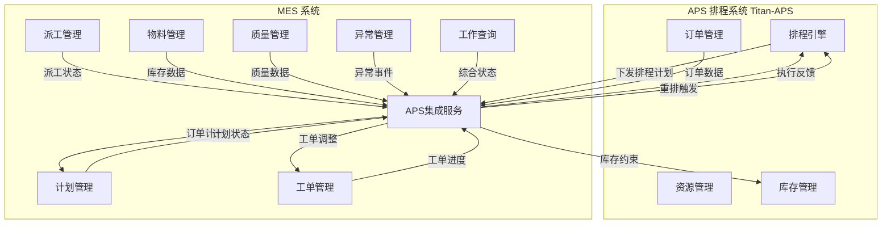
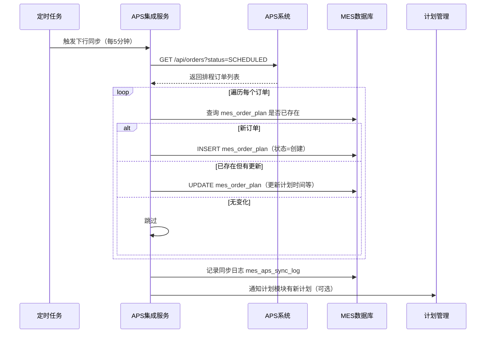
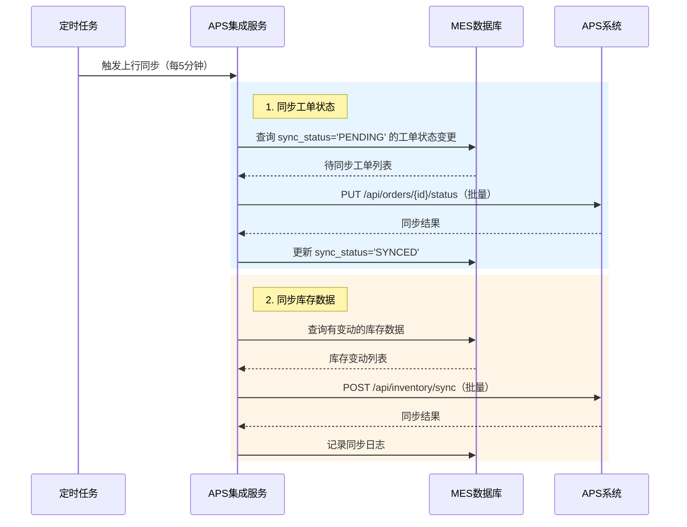
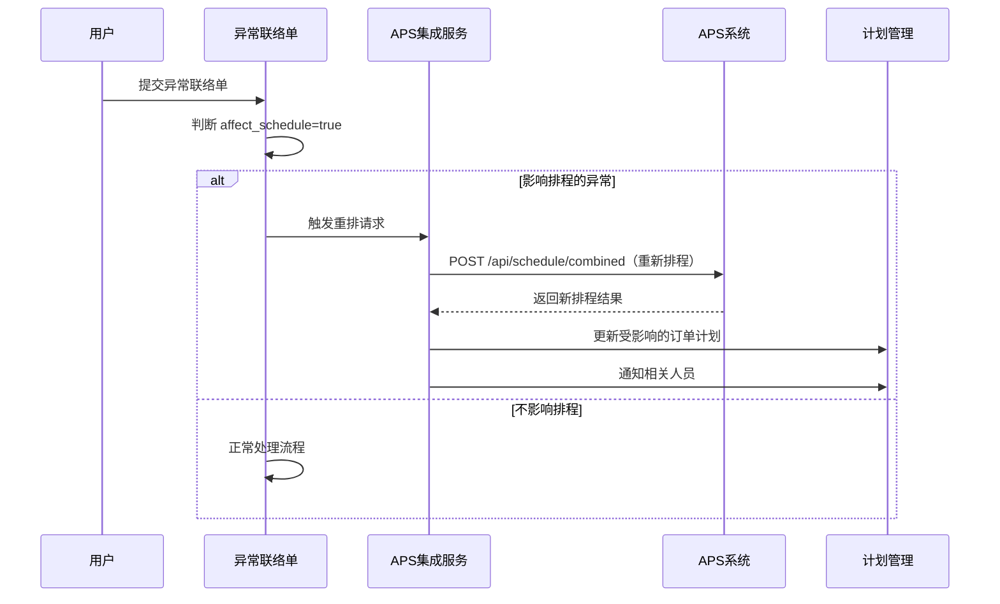
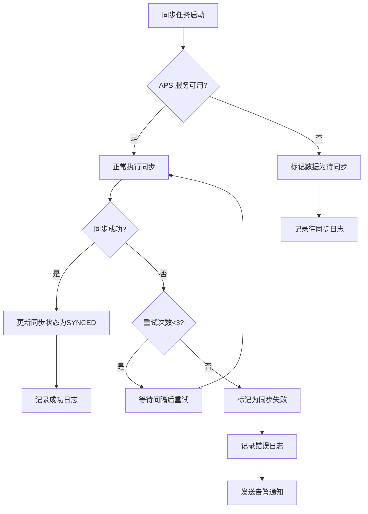
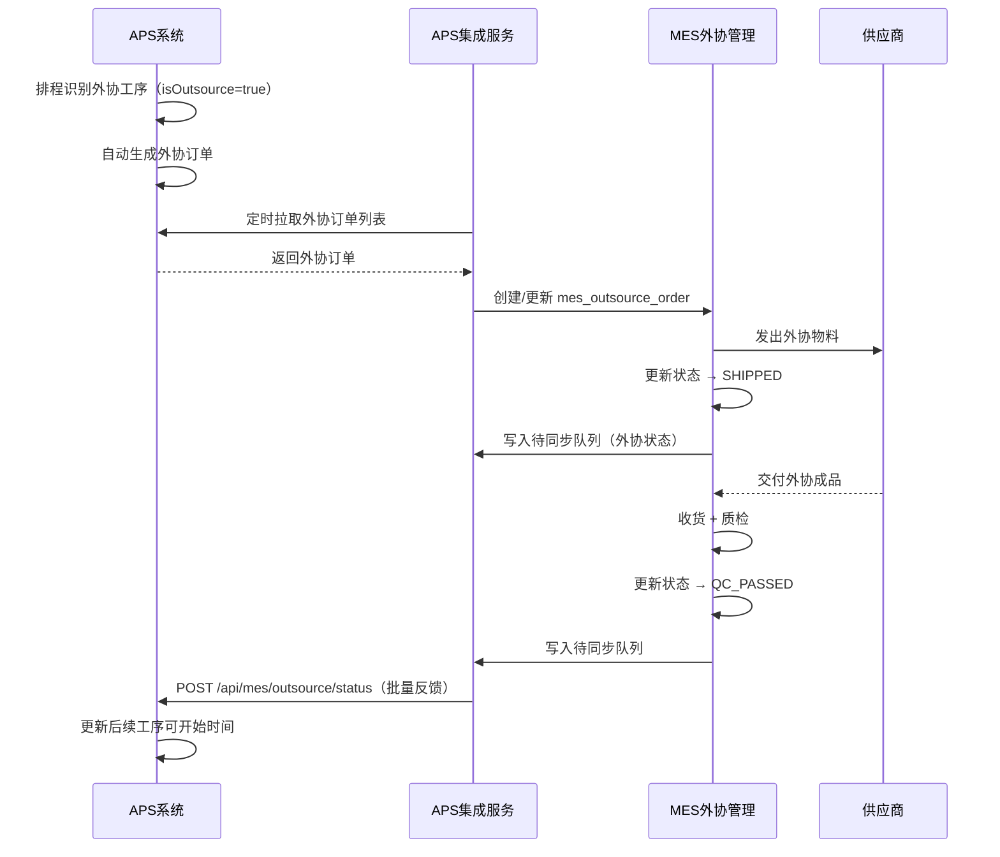
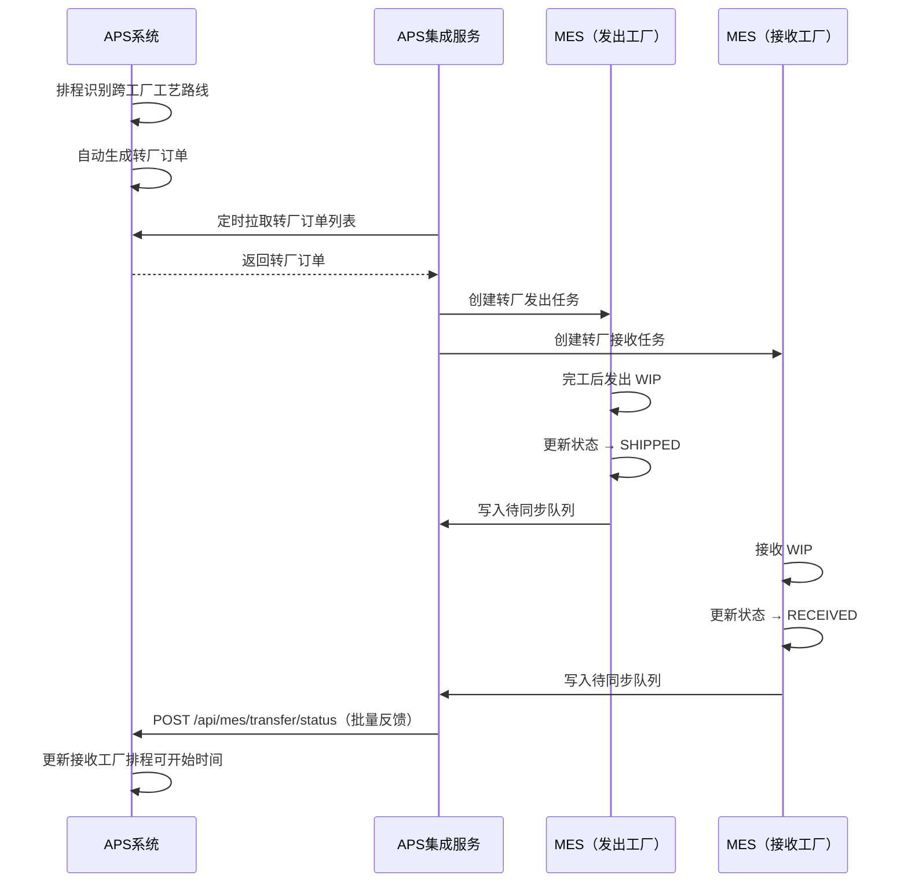
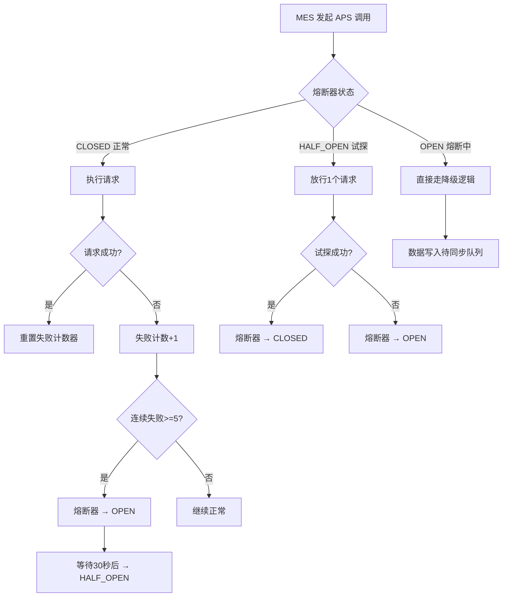
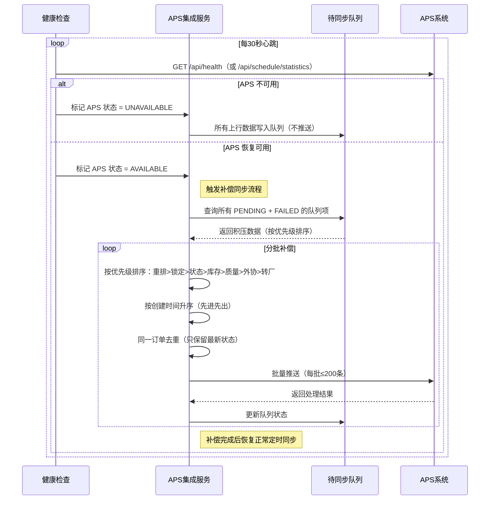

# APS 集成模块需求分析

## 1. 模块概述

APS 集成模块是 MES 系统与 APS（Titan APS）排程系统之间的数据桥梁，负责双向数据同步、状态反馈与异常驱动的重排调度。本模块采用**混合交互模式**（查询用 REST API，事件通知预留 MQ 扩展），支持**定时批量同步**（默认每 5 分钟），确保两个系统之间的数据最终一致性。

### 1.1 模块定位



### 1.2 核心目标

- **数据闭环**：APS 排程结果自动同步至 MES 计划管理，MES 执行数据自动反馈至 APS
- **松耦合**：APS 不可用时 MES 可独立运行，待恢复后自动补偿同步
- **可追溯**：所有同步操作记录日志，支持按批次查询和回滚
- **可扩展**：预留消息队列接口，后续可平滑升级为微服务版本

## 2. 功能清单

### 2.1 下行同步（APS → MES）

| 功能 | 说明 | 同步方式 |
|------|------|----------|
| **排程计划同步** | 接收 APS 排程结果，创建/更新 MES 订单计划 | 定时拉取（每 5 分钟） |
| **排程任务同步** | 接收 APS 排程任务（含任务分段），同步到 MES 工作清单 | 定时拉取 |
| **工单调整同步** | 接收 APS 调整的工单优先级、计划时间 | 定时拉取 |
| **资源调度建议** | 接收 APS 推荐的资源分配方案和资源负荷数据 | 定时拉取 |
| **物料需求计划** | 接收 APS 下发的物料需求计划（MRP） | 定时拉取 |
| **外协订单同步** | 接收 APS 自动生成的外协订单 | 定时拉取 |
| **转厂订单同步** | 接收 APS 自动生成的转厂订单 | 定时拉取 |
| **资源日历同步** | 拉取 APS 资源日历和班次数据 | 定时拉取（低频） |
| **换型时间矩阵** | 拉取 APS 设备换型时间参考数据 | 定时拉取（低频） |
| **排程统计/警告** | 拉取 APS 排程健康度指标和警告信息 | 按需拉取 |

### 2.2 上行同步（MES → APS）

| 功能 | 说明 | 同步方式 |
|------|------|----------|
| **计划状态反馈** | 计划下达/完成/终止状态回传 APS | 定时推送（每 5 分钟） |
| **工单进度反馈** | 工单开工/完工/强制完工状态回传 APS | 定时推送 |
| **派工状态反馈** | 任务分派/完成状态回传 APS | 定时推送 |
| **库存数据同步** | 非限制库存数据同步给 APS 作为排程约束 | 定时推送 |
| **物料消耗反馈** | 领料确认后物料消耗数据回传 APS | 定时推送 |
| **质量数据反馈** | 检验结果（合格率、不良品数、返工需求）回传 APS | 定时推送 |
| **外协执行反馈** | 外协订单发出/收货/质检状态回传 APS | 定时推送 |
| **转厂物流反馈** | 转厂订单发出/到达/接收状态回传 APS | 定时推送 |
| **异常重排触发** | 关键异常事件触发 APS 重新排程 | 实时推送（REST） |

### 2.3 同步管理

| 功能 | 说明 |
|------|------|
| **同步配置** | 管理同步频率、开关、APS 连接信息 |
| **同步日志** | 记录每次同步的批次号、时间、数据量、结果 |
| **同步监控** | 监控同步状态，异常告警 |
| **手动同步** | 支持手动触发全量/增量同步 |
| **数据映射管理** | 管理 APS 与 MES 实体的编码映射关系 |

## 3. 业务流程

### 3.1 下行同步流程（APS → MES）



### 3.2 上行同步流程（MES → APS）



### 3.3 异常触发重排流程



## 4. 同步服务设计

### 4.1 同步策略

| 策略项 | 配置 | 说明 |
|--------|------|------|
| **同步频率** | 5 分钟 | 默认每 5 分钟执行一次定时同步 |
| **同步模式** | 增量同步 | 基于 `updated_time` 字段识别变更数据 |
| **批处理大小** | 200 条/批 | 单次请求最多处理 200 条数据 |
| **超时时间** | 30 秒 | 单次 HTTP 请求超时时间 |
| **重试策略** | 3 次 | 失败后重试 3 次，间隔 5s/15s/30s |
| **降级策略** | 标记待同步 | APS 不可用时数据标记为"待同步" |
| **全量同步** | 手动触发 | 支持手动触发全量同步（初始化或数据修复） |

### 4.2 增量识别机制

```
每次同步记录上次同步的时间戳 → last_sync_time
查询条件：WHERE updated_time > last_sync_time
同步成功后更新 last_sync_time = 本次同步时间
```

### 4.3 冲突处理规则

| 场景 | 处理策略 | 说明 |
|------|----------|------|
| APS 下发的计划与 MES 已执行的实际冲突 | MES 实际执行优先 | 已开工的工单不接受 APS 时间调整 |
| 同一订单在两端同时修改 | 以 MES 实际为准 | MES 的执行状态优先级高于 APS 计划状态 |
| APS 重排后订单不在新计划中 | 保留 MES 数据 | 不自动删除 MES 中已有的订单计划 |
| 同步过程中的新增数据 | 下次同步处理 | 避免同步窗口冲突 |

### 4.4 降级与容错



### 4.5 同步开关控制

- **全局开关**：`aps.sync.enabled=true/false`，关闭后所有同步任务暂停
- **下行开关**：`aps.sync.downstream.enabled=true/false`，单独控制 APS→MES 同步
- **上行开关**：`aps.sync.upstream.enabled=true/false`，单独控制 MES→APS 同步
- **重排触发开关**：`aps.sync.reschedule.enabled=true/false`，单独控制异常重排触发

## 5. 页面需求

### 5.1 同步配置页面

**页面入口**  
系统设置 → APS 集成配置

**配置项**
- APS 服务地址：`http://aps-host:port`
- 同步频率（分钟）
- 批处理大小（条/批）
- 全局同步开关
- 下行同步开关
- 上行同步开关
- 重排触发开关
- 连接超时（秒）
- 重试次数

### 5.2 同步日志页面

**页面入口**  
系统设置 → APS 同步日志

**查询条件**
- 同步方向（下行/上行）
- 同步状态（成功/失败/部分成功）
- 时间范围
- 批次号

**列表字段**
- 批次号
- 同步方向（下行/上行）
- 同步类型（订单/工单/库存/异常）
- 数据量（条）
- 成功数/失败数
- 同步状态
- 开始时间
- 结束时间
- 耗时（ms）
- 错误信息

### 5.3 数据映射管理页面

**页面入口**  
系统设置 → APS 数据映射

**映射维度**
- 物料编码映射：MES `material_code` ↔ APS `Item.code`
- 工作中心映射：MES `work_center_code` ↔ APS `Resource.code`
- 状态映射：MES 订单状态 ↔ APS 订单状态

**列表字段**
- 映射类型（物料/工作中心/状态）
- MES 编码
- MES 名称
- APS 编码
- APS 名称
- 状态（启用/禁用）
- 创建时间
- 修改时间

## 6. 业务规则

### 6.1 同步优先级

1. **异常重排**：最高优先级，立即执行（不等待定时任务）
2. **工单状态变更**：高优先级，影响 APS 排程准确性
3. **库存变动**：中优先级，影响物料约束
4. **质量数据**：低优先级，辅助排程优化

### 6.2 重排触发条件

| 异常类型 | 触发方式 | 严重级别 | 说明 |
|----------|----------|----------|------|
| 设备故障 | 立即触发 | CRITICAL | 设备不可用，影响多个工单 |
| 物料短缺 | 立即触发 | HIGH | 物料不足，影响生产连续性 |
| 质量异常（批量） | 立即触发 | HIGH | 批量不合格需返工或补产 |
| 紧急插单 | 立即触发 | HIGH | 需重新优化排程 |
| 客户交期变更 | 立即触发 | HIGH | 交期提前/延后影响排程优先级 |
| 工艺路线变更 | 立即触发 | HIGH | 工序增减或资源变更影响排程 |
| 外协延迟 | 立即触发 | HIGH | 外协工序延期影响后续工序 |
| 转厂物流延误 | 立即触发 | MEDIUM | 跨工厂物流延迟影响接收方排程 |
| 人员缺勤 | 定时同步 | MEDIUM | 可通过人员调配解决 |
| 产能变化 | 定时同步 | MEDIUM | 设备效率变化或新增/停用设备 |
| 小批量质量问题 | 定时同步 | LOW | 影响范围小 |

### 6.3 数据有效性校验

- 同步前校验物料编码在 MES 中是否存在
- 同步前校验工作中心编码映射是否配置
- 数量字段不允许为负数
- 时间字段格式统一为 ISO 8601

## 7. 权限与审计

- 权限粒度：查看同步配置、修改同步配置、查看同步日志、手动触发同步、管理数据映射
- 同步操作记录审计日志（操作人、操作时间、同步批次、同步结果）
- 同步失败时发送告警通知给管理员

## 8. 与其他模块关系

| 模块 | 关系 | 说明 |
|------|------|------|
| **计划管理** | 核心衔接 | 接收 APS 下发的排程计划，反馈计划状态 |
| **生产工单** | 状态反馈 | 工单状态变更触发同步任务 |
| **生产派工** | 状态反馈 | 派工状态变更触发同步任务 |
| **物料管理** | 数据同步 | 库存数据定时同步给 APS |
| **异常联络单** | 重排触发 | 关键异常触发 APS 重新排程 |
| **成品质量管理** | 数据反馈 | 质量数据反馈影响排程优化 |
| **工作查询** | 综合监控 | 工作六状态数据汇总反馈 |

## 9. 数据库设计（表结构）

### 9.1 APS 同步配置表 `mes_aps_sync_config`

| 字段 | 类型 | 说明 |
|---|---|---|
| id | BIGINT | 主键 |
| config_key | VARCHAR(100) | 配置键 |
| config_value | VARCHAR(500) | 配置值 |
| config_desc | VARCHAR(200) | 配置说明 |
| enabled | TINYINT(1) | 是否启用 |
| created_by | VARCHAR(50) | 创建人 |
| created_time | DATETIME | 创建时间 |
| updated_by | VARCHAR(50) | 修改人 |
| updated_time | DATETIME | 修改时间 |

### 9.2 APS 同步日志表 `mes_aps_sync_log`

| 字段 | 类型 | 说明 |
|---|---|---|
| id | BIGINT | 主键 |
| batch_id | VARCHAR(64) | 同步批次号（UUID） |
| sync_direction | VARCHAR(20) | 同步方向（DOWNSTREAM/UPSTREAM） |
| sync_type | VARCHAR(50) | 同步类型（ORDER/WORKORDER/INVENTORY/ABNORMAL） |
| total_count | INT | 数据总量 |
| success_count | INT | 成功数量 |
| fail_count | INT | 失败数量 |
| status | VARCHAR(20) | 同步状态（SUCCESS/FAIL/PARTIAL） |
| start_time | DATETIME | 开始时间 |
| end_time | DATETIME | 结束时间 |
| duration_ms | BIGINT | 耗时（毫秒） |
| error_message | TEXT | 错误信息 |
| created_time | DATETIME | 创建时间 |

### 9.3 APS 同步数据明细表 `mes_aps_sync_detail`

| 字段 | 类型 | 说明 |
|---|---|---|
| id | BIGINT | 主键 |
| batch_id | VARCHAR(64) | 同步批次号 |
| data_type | VARCHAR(50) | 数据类型（ORDER/WORKORDER/INVENTORY） |
| data_id | BIGINT | 关联数据ID |
| data_no | VARCHAR(100) | 关联数据编号（如订单号） |
| sync_action | VARCHAR(20) | 同步动作（CREATE/UPDATE/DELETE） |
| sync_status | VARCHAR(20) | 同步状态（SUCCESS/FAIL/PENDING） |
| aps_data | JSON | APS 侧数据快照 |
| mes_data | JSON | MES 侧数据快照 |
| error_message | VARCHAR(500) | 错误信息 |
| retry_count | INT | 重试次数 |
| created_time | DATETIME | 创建时间 |
| updated_time | DATETIME | 修改时间 |

### 9.4 APS 数据映射表 `mes_aps_data_mapping`

| 字段 | 类型 | 说明 |
|---|---|---|
| id | BIGINT | 主键 |
| mapping_type | VARCHAR(50) | 映射类型（MATERIAL/WORK_CENTER/STATUS） |
| mes_code | VARCHAR(100) | MES 编码 |
| mes_name | VARCHAR(200) | MES 名称 |
| aps_code | VARCHAR(100) | APS 编码 |
| aps_name | VARCHAR(200) | APS 名称 |
| enabled | TINYINT(1) | 是否启用 |
| created_by | VARCHAR(50) | 创建人 |
| created_time | DATETIME | 创建时间 |
| updated_by | VARCHAR(50) | 修改人 |
| updated_time | DATETIME | 修改时间 |
| deleted | TINYINT(1) | 逻辑删除 |

### 9.5 待同步队列表 `mes_aps_sync_queue`

| 字段 | 类型 | 说明 |
|---|---|---|
| id | BIGINT | 主键 |
| sync_direction | VARCHAR(20) | 同步方向（DOWNSTREAM/UPSTREAM） |
| sync_type | VARCHAR(50) | 同步类型 |
| data_type | VARCHAR(50) | 数据类型 |
| data_id | BIGINT | 关联数据ID |
| data_no | VARCHAR(100) | 关联数据编号 |
| priority | INT | 优先级（1最高） |
| sync_status | VARCHAR(20) | 状态（PENDING/PROCESSING/SYNCED/FAILED） |
| retry_count | INT | 已重试次数 |
| max_retry | INT | 最大重试次数 |
| next_retry_time | DATETIME | 下次重试时间 |
| payload | JSON | 同步数据载荷 |
| error_message | VARCHAR(500) | 错误信息 |
| created_time | DATETIME | 创建时间 |
| updated_time | DATETIME | 修改时间 |

## 10. 高级功能集成规划

### 10.1 MES 定位与集成边界

MES 在 APS 集成中的定位为 **执行计划 + 反馈数据 + 记录数据**。MES 不参与排程决策，不做排程优化或模拟分析。以下 APS 高级功能纳入当前集成范围：

| 功能 | 集成方式 | MES 职责 |
|------|---------|---------|
| 任务分段（TaskSegment） | 下行拉取 | 接收跨班次任务分段，按分段执行和汇报 |
| 换型时间矩阵（SetupMatrix） | 下行拉取（只读） | 展示换型准备信息给现场操作人员 |
| 外协订单管理 | 双向同步 | 接收外协订单，追踪执行（发出/收货/质检），反馈状态 |
| 转厂订单管理 | 双向同步 | 接收转厂订单，追踪物流（发出/到达/接收），反馈状态 |
| 排程统计/警告 | 下行拉取（只读） | 展示排程健康度和警告给计划管理人员 |
| 资源负荷查询 | 下行拉取（只读） | 派工时参考 APS 资源负荷数据 |

以下 APS 功能 **不纳入** 当前集成（MES 不涉及规划决策）：

| 功能 | 排除原因 |
|------|---------|
| WhatIf 模拟分析 | 纯规划工具，不属于执行层 |
| 排程优化（退火算法） | APS 内部优化，MES 只消费排程结果 |
| 预测评估 | 预测属于计划层，不属于执行层 |
| 物料 Pegging 追溯 | 供需分析工具，可按需查 APS |
| APS 仪表盘 | APS 自有分析视图，MES 有自己的执行看板 |

### 10.2 外协订单管理流程



### 10.3 转厂订单管理流程



### 10.4 任务分段执行模式

MES 接收到包含 `segments` 的排程任务时，按以下规则处理：

1. **同步阶段**：将 `segments` 数组写入 `mes_work_order_task_segment` 子表
2. **派工阶段**：可按分段分配给不同班组（如白班/晚班）
3. **执行阶段**：操作员按当前班次的分段执行，分段独立汇报开始/完成
4. **反馈阶段**：所有分段完成后，整个任务标记为完成，汇总数据反馈 APS

## 11. 技术规范

### 11.1 API 版本管理

- 当前版本：v1（接口路径无版本号前缀）
- 未来演进时在路径中增加版本号：`/api/v2/...`
- 向后兼容原则：新版本接口上线后，旧版本保留至少 2 个迭代周期
- 版本切换通过 `mes_aps_sync_config` 配置管理

### 11.2 熔断与限流



**熔断参数**：

| 参数 | 值 | 说明 |
|------|---|------|
| failureThreshold | 5 | 连续失败 5 次触发熔断 |
| openTimeout | 30s | 熔断打开持续时间 |
| halfOpenMaxAttempts | 1 | 半开状态试探请求数 |
| slowCallThreshold | 10s | 慢调用阈值 |

**限流参数**：

| 参数 | 值 | 说明 |
|------|---|------|
| 同步接口调用频率 | 不超过 12 次/分钟 | 滑动窗口限流 |
| 单次批量上限 | 200 条 | 单次同步最大数据量 |
| 异常重排触发 | 同类异常 5 分钟内仅 1 次 | 防抖限流 |

### 11.3 补偿同步机制

当 APS 服务宕机或网络中断后恢复时，MES 需执行补偿同步，确保数据最终一致。



**补偿同步规则**：

| 规则 | 说明 |
|------|------|
| 优先级排序 | 异常重排(P1) > 订单锁定/解锁(P2) > 状态同步(P3) > 库存同步(P4) > 质量数据(P5) > 外协/转厂(P6) |
| 去重合并 | 同一订单的多次状态变更只推送最终状态 |
| 时序保证 | 同一订单的操作按时间顺序执行（先锁定后解锁） |
| 分批处理 | 每批最多 200 条，批间间隔 2 秒，避免 APS 过载 |
| 失败重试 | 单条数据最多重试 3 次，超过标记为 FAILED 待人工处理 |
| 幂等保证 | 所有推送基于 syncBatchId 幂等，重复推送不会产生副作用 |

### 11.4 监控与告警

| 监控指标 | 告警阈值 | 通知方式 | 说明 |
|----------|---------|---------|------|
| APS 连接状态 | 连续 3 次心跳失败 | 即时通知管理员 | APS 服务不可用 |
| 同步失败率 | 单批次失败率 > 20% | 即时通知 | 数据质量或网络问题 |
| 同步延迟 | 队列积压 > 500 条 | 预警 | 同步速度跟不上产生速度 |
| 同步耗时 | 单批次 > 30 秒 | 预警 | 性能退化 |
| 映射缺失 | 新增缺失记录 | 每日汇总通知 | 需补充映射配置 |
| 重排频率 | 1 小时内 > 5 次重排 | 预警 | 生产异常频繁 |
| 补偿队列 | FAILED 状态 > 10 条 | 即时通知 | 需人工介入处理 |

### 11.5 安全认证

| 项目 | 方案 | 说明 |
|------|------|------|
| 认证方式 | API Key | 请求头 `X-API-Key` 传递 |
| Key 管理 | 配置化 | 通过 `mes_aps_sync_config` 表管理 |
| Key 轮换 | 定期更新 | 建议每 90 天轮换一次 |
| 传输加密 | HTTPS（生产环境） | 开发/测试环境可用 HTTP |
| IP 白名单 | 可选 | APS 端配置允许访问的 MES 服务器 IP |
| 审计日志 | 全量记录 | 所有 API 调用记录到同步日志表 |
