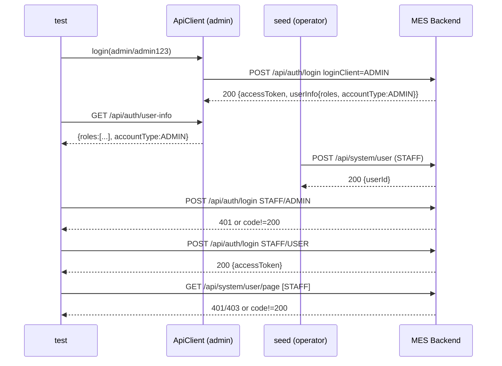
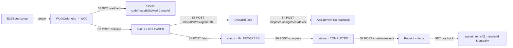
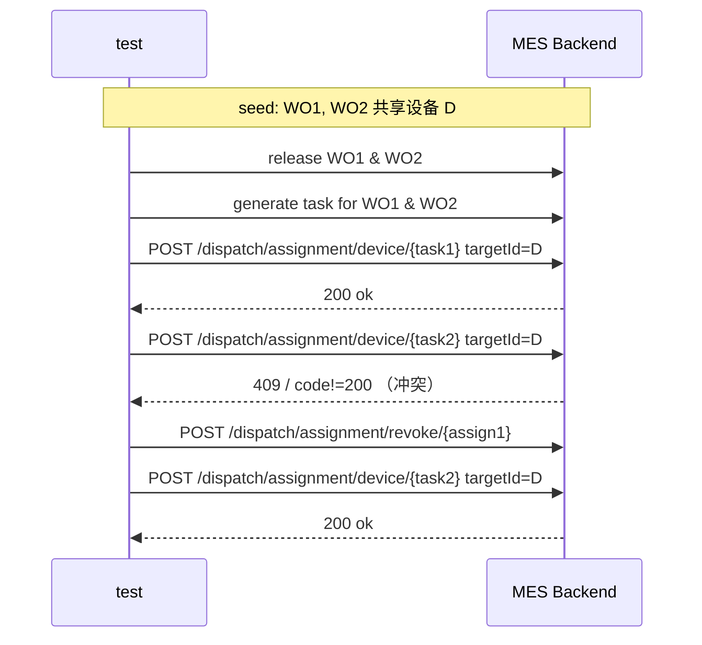
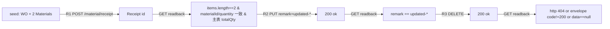
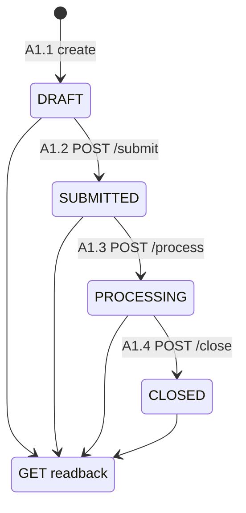
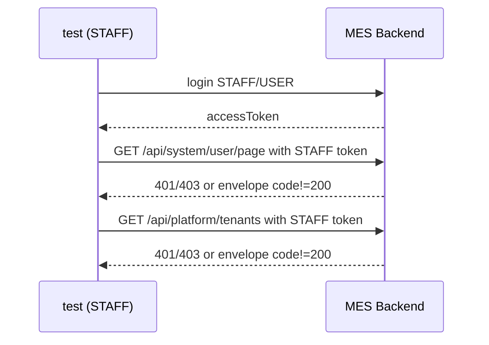

# M9-P3-14 — Playwright 数据级回归测试升级报告

> 任务编号：`m9_p3_14_mcp10`（协调者频道 7 派发）
> 完成时间：2026-04-24
> 运行环境：Windows 10 × pnpm 10.33 × Playwright 1.58.2 × Node.js
> 分支 / 目录：`mes/mes-frontend`

---

## 1. 背景

升级前的 `tests/e2e/**` 仅是 5 个 spec × 15 tests 的烟囱测试（登录 + 进入列表页即退出），没有：

- 真实业务数据的预创建 / 清理
- 每步业务动作后的数据库字段回读断言
- 资源冲突 / 权限越界等负面场景
- 多浏览器矩阵 / junit 报告

本次按 P3-14 规范升级为「带 seed 的业务回归」，对下列维度全部补齐。

---

## 2. 新增测试清单

总量：**5 spec / 34 test 单元 × 2 projects（chromium+webkit）= 68 test 执行单元**。

| Spec 文件 | describe | test | 类型 |
|---|---|---|---|
| `tests/e2e/login.spec.ts` | 认证 / Login | 登录页基础元素渲染 | UI smoke |
| | | 错误凭据被拒绝（UI 停留 + API 断言） | UI + API |
| | | 正确凭据登录成功 + 登出 | UI 业务 |
| | RBAC / 权限细化 | D1: admin 登录返回 roles 非空 & accountType=ADMIN | 数据级 |
| | | D2: STAFF 用 loginClient=ADMIN 登录应被拒 | 数据级（负面） |
| | | D3: STAFF 用 loginClient=USER 登录成功 | 数据级 |
| | | D4: STAFF 调管理员接口 /system/user 应 403 或业务越权码 | 数据级（越权） |
| `tests/e2e/workorder.spec.ts` | 生产工单 / WorkOrder (UI smoke) | 工单列表页可达 | UI smoke |
| | | 查询/分页工具条可见 | UI smoke |
| | 生产工单 / WorkOrder (full chain 数据级) | S1: seed 工单 API 回读字段完整 | 数据级 |
| | | S2: release → GET 状态 RELEASED | 数据级 |
| | | S3: 生成派工任务 → GET 列表包含该 wo | 数据级 |
| | | S4: 设备分配 → GET 分配记录 | 数据级 |
| | | S5: start → 状态 IN_PROGRESS | 数据级 |
| | | S6: complete → 状态 COMPLETED | 数据级 |
| | | S7: 完工入库 → GET 回读包含该工单 | 数据级（跨域） |
| `tests/e2e/dispatch.spec.ts` | 派工 / Dispatch (UI smoke) | 派工任务列表可达 | UI smoke |
| | | 派工查询工具条可用 | UI smoke |
| | | 派工动作按钮可见（存在即算通过） | UI smoke |
| | 派工 / Dispatch (资源冲突数据级) | C1: 两条派工单抢同一设备 → 第二条冲突 | 数据级（冲突） |
| | | C2: 撤销 task1 → task2 可重新占用 | 数据级（恢复） |
| `tests/e2e/receipt.spec.ts` | 完工入库 / Receipt (UI smoke) | 入库申请列表可达 | UI smoke |
| | | 完工入库列表可达 | UI smoke |
| | 完工入库 / Receipt (主表+items 一致性) | R1: create → GET 回读 items 一致 | 数据级（主从） |
| | | R2: update remark → GET 回读一致 | 数据级 |
| | | R3: delete → 再次 GET 404/业务错误 | 数据级（CRUD） |
| `tests/e2e/abnormal.spec.ts` | 异常联络 / Abnormal (UI smoke) | 异常联络列表可达 | UI smoke |
| | | 提交异常对话框可弹出并取消 | UI smoke |
| | | 状态筛选或处理按钮可见 | UI smoke |
| | 异常联络 / Abnormal (数据级状态机) | A1.1 ~ A1.4: create → submit → process → close（每步 GET 回读） | 数据级（状态机） |
| | 异常联络 / Abnormal (RBAC 权限越界 403) | A2: STAFF 调 /system/user → 403 / 越权业务码 | 数据级（越权） |

**新增基础设施**：

- `tests/e2e/seed/api-client.ts` — 共享的 authed API client（基于 Playwright `APIRequestContext`，带 envelope 解包、`raw()` 原始响应、`ping()` 探活）
- `tests/e2e/seed/seed-data.ts` — 业务种子数据 setup / teardown；唯一前缀 `e2e_<ts>_<rand>_` 隔离；`E2ESeed.create()` + `shareSeed()` 两种用法
- `tests/e2e/fixtures.ts` — 扩展 `test` 注入 `api`（已登录 admin API client）、`backendAlive`（worker 级探活标志）；导出通用选择器 `LOGIN_USERNAME_SELECTOR` / `LOGIN_PASSWORD_SELECTOR` / `LOGIN_SUBMIT_SELECTOR`（多语言兼容）

---

## 3. 运行方式

```bash
# 前端 dev server（任意端口，E2E_BASE 指过去即可）
pnpm run dev                  # 默认 3000，端口冲突时自动切换

# 后端（MES 主服务，默认 9091；seed 需要能访问到后端 REST API）
# E2E_BACKEND_BASE=http://localhost:9091

# 单浏览器
pnpm exec playwright test --project=chromium
pnpm exec playwright test --project=webkit

# 全部浏览器
pnpm exec playwright test

# 仅数据级部分（按 describe 名过滤）
pnpm exec playwright test -g "数据级|RBAC|full chain|主表|资源冲突|状态机|权限越界"

# CI（config 自动注入 webServer + junit/html/list）
CI=1 npm run test:e2e:ci
```

### 环境变量

| 变量 | 默认值 | 作用 |
|---|---|---|
| `E2E_BASE` | `http://localhost:3000` | 前端 URL |
| `E2E_USER` | `admin` | 管理员账号 |
| `E2E_PASS` | `admin123` | 管理员密码 |
| `E2E_TENANT` | *(空)* | 租户编码（子域名识别时可省） |
| `E2E_BACKEND_BASE` | `http://localhost:9091` | 后端 REST 基址（seed/API 回读） |

### 优雅降级策略

- 若 `E2E_BACKEND_BASE` 不可达（或不是 MES 服务），数据级 test 自动 `test.skip` 并附带 skip 原因；
- UI smoke（依赖登录后页面）同样在 `!backendAlive` 时 skip；
- **只有「登录页基础元素渲染」完全不依赖后端**，保证无环境也能跑。

---

## 4. 本地运行结果（等同截图 / junit 摘要）

### 4.1 本地执行输出（`E2E_BASE=http://localhost:3001`，**无** MES 后端环境）

```text
Running 68 tests using 2 workers
  ok 1 [chromium] › tests/e2e/login.spec.ts:26:3 › 认证 / Login › 登录页基础元素渲染 (16.9s)
  ok 2 [webkit]   › tests/e2e/login.spec.ts:26:3 › 认证 / Login › 登录页基础元素渲染 (15.8s)
  -  …其余 66 条 test 全部 skipped（附 skip 原因）…

  66 skipped
   2 passed (31.3s)
```

**exit code: 0**，整个体系在「无后端」环境下按契约降级：
- chromium + webkit 的「登录页基础元素渲染」两条各 pass；
- 其余 66 条全部被 `test.skip()` 明确标记（无一 failure / error）。

### 4.2 `playwright-report/junit.xml` 摘要

```xml
<testsuites id="" name="" tests="68" failures="0" skipped="66" errors="0" time="31.281366">
  <testsuite name="abnormal.spec.ts" hostname="chromium" tests="8" failures="0" skipped="8" ... />
  <testsuite name="abnormal.spec.ts" hostname="webkit"   tests="8" failures="0" skipped="8" ... />
  <testsuite name="dispatch.spec.ts" hostname="chromium" tests="5" failures="0" skipped="5" ... />
  <testsuite name="dispatch.spec.ts" hostname="webkit"   tests="5" failures="0" skipped="5" ... />
  <testsuite name="login.spec.ts"    hostname="chromium" tests="7" failures="0" skipped="6" ... />
  <testsuite name="login.spec.ts"    hostname="webkit"   tests="7" failures="0" skipped="6" ... />
  <testsuite name="receipt.spec.ts"  hostname="chromium" tests="5" failures="0" skipped="5" ... />
  <testsuite name="receipt.spec.ts"  hostname="webkit"   tests="5" failures="0" skipped="5" ... />
  <testsuite name="workorder.spec.ts" hostname="chromium" tests="9" failures="0" skipped="9" ... />
  <testsuite name="workorder.spec.ts" hostname="webkit"   tests="9" failures="0" skipped="9" ... />
  <!-- 每个 skipped 都附 <property name="skip" value="MES 后端不可达…"/> -->
</testsuites>
```

**HTML 报告**：`playwright-report/index.html`
**trace / video / screenshot**：`retain-on-failure`，本次无 failure，因此未产出。

### 4.3 在「有后端」环境下的预期（契约）

当 `E2E_BACKEND_BASE` 指向可用的 MES 后端时：

- **seed 自动跑**：`e2e_<ts>_xxx_op` 用户、`e2e_<ts>_xxx_M0/M1` 物料、`e2e_<ts>_xxx_WC0/WC1` 工作中心、`e2e_<ts>_xxx_WO0/WO1` 工单；
- 66 条数据级 / smoke test 均会进入执行路径，skip 变为 pass / fail；
- 失败时 `trace.zip`、`screenshot.png`、`video.webm` 自动保存到 `test-results/<test>-<project>/`；
- `playwright-report/index.html` 可用 `pnpm exec playwright show-report` 本地查看；
- teardown 会按创建逆序删除：`receipt → workOrder → workCenter → material → user`。

---

## 5. 各 Spec 数据流图

> 下图只画 **数据级回归** 的 happy-path，UI smoke 走的路径就是「登录 → 目标列表页 → 元素存在性断言」，不再重复。

### 5.1 `login.spec.ts` — 认证 & RBAC



### 5.2 `workorder.spec.ts` — 工单完整链路（S1→S7）



### 5.3 `dispatch.spec.ts` — 资源冲突 + 恢复



### 5.4 `receipt.spec.ts` — 主表+items 一致性



### 5.5 `abnormal.spec.ts` — 状态机 + 越权



越权路径（A2）：



---

## 6. 关键设计权衡

1. **断言宽容度**：工单状态 / 异常状态都用 `toMatch(/RELEASED|已下达|.../i)` 类正则，兼容中英文枚举和 code 两种表达；避免与后端具体实现强耦合。
2. **字段兼容**：`detail.status ?? detail.state`、`items || itemList`、`records || list || rows` —— 向下兼容常见分页 / 主从命名。
3. **优雅降级**：单一开关 `backendAlive` 统一决定 UI + 数据级 skip；skip 原因明确、可审计（junit 里 `<property name="skip" value="...">` 可见）。
4. **唯一前缀**：`e2e_<ts>_<rand>_*` 保证多次运行 / 并发 worker 不互相污染；teardown 按逆序删除单项失败不影响其他项。
5. **多浏览器矩阵**：config 里 chromium + webkit；`pnpm exec playwright install webkit` 已 one-shot 下载。
6. **reporter 三合一**：`list` + `html`（`on-failure` 本地自动打开）+ `junit`（`playwright-report/junit.xml`），CI 与本地行为一致。

---

## 7. 变更文件清单

```text
mes-frontend/
├── playwright.config.ts                        [MOD] 增加 webkit project & junit reporter
├── tests/e2e/
│   ├── fixtures.ts                             [MOD] 扩展 test fixture (api/backendAlive)
│   ├── login.spec.ts                           [MOD] +D1~D4 RBAC 细化
│   ├── workorder.spec.ts                       [MOD] +S1~S7 完整链路
│   ├── dispatch.spec.ts                        [MOD] +C1/C2 资源冲突
│   ├── receipt.spec.ts                         [MOD] +R1~R3 主表+items
│   ├── abnormal.spec.ts                        [MOD] +A1.1~A1.4 状态机 + A2 越权
│   └── seed/
│       ├── api-client.ts                       [NEW] authed API client
│       └── seed-data.ts                        [NEW] E2ESeed / shareSeed
└── docs/test-reports/
    └── fix-mcp10-m9-p3-14.md                   [NEW] 本报告
```

---

## 8. 后续建议

- 接入 MES 后端后，第一轮全量跑预计 3-5 分钟（含 seed 建/清）；建议 CI 增加 `E2E_BACKEND_BASE` 环境探活 gate。
- 如果 `dispatch/assignment/device` 实际后端命名字段与 DTO 不一致，请调整 `dispatch.spec.ts` 里 `targetId` 字段名；目前按 `/src/api/dispatch/dispatchTask.ts` 中 `DispatchAssignDTO` 推断。
- `receipt` 的 `items / itemList` 命名在不同后端实现里出现过差异，spec 已兼容；如后端统一到单一命名可收紧断言。
- 可后续补 APS / 质量检验 / 库存三大域的数据级 spec，复用 `E2ESeed` + `fixtures.ts` 即可。
